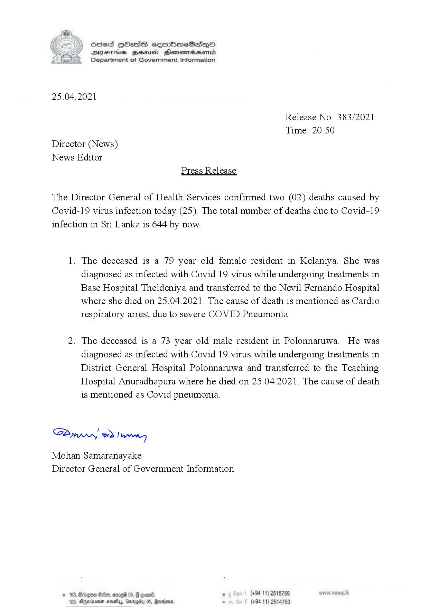

# Press Release - 2021.04.25 
Key: ec9afd302d72d4b6078e50caa9633d73 

---
```
CSE ) SSeS HOHassG eembmeSads—QoO
. DVsthis Zesisd Henesdacmbd
Department of Government Information

 

25.04.2021

Release No: 383/2021
Time: 20.50
Director (News)
News Editor
Press Release

The Director General of Health Services confirmed two (02) deaths caused by
Covid-19 virus infection today (25). The total number of deaths due to Covid-19
infection in Sri Lanka is 644 by now.

1. The deceased is a 79 year old female resident in Kelaniya. She was
diagnosed as infected with Covid 19 virus while undergoing treatments in
Base Hospital Theldeniya and transferred to the Nevil Fernando Hospital
where she died on 25.04.2021. The cause of death is mentioned as Cardio
respiratory arrest due to severe COVID Pneumonia.

2. The deceased is a 73 year old male resident in Polonnaruwa. He was
diagnosed as infected with Covid 19 virus while undergoing treatments in
District General Hospital Polonnaruwa and transferred to the Teaching
Hospital Anuradhapura where he died on 25.04.2021. The cause of death
is mentioned as Covid pneumonia.

Sawwy 2) wry

Mohan Samaranayake
Director General of Government Information

GOD BOO, ome 05,
Aryerinionen sevetay, Ga rogit

     

, Rerons,

```
