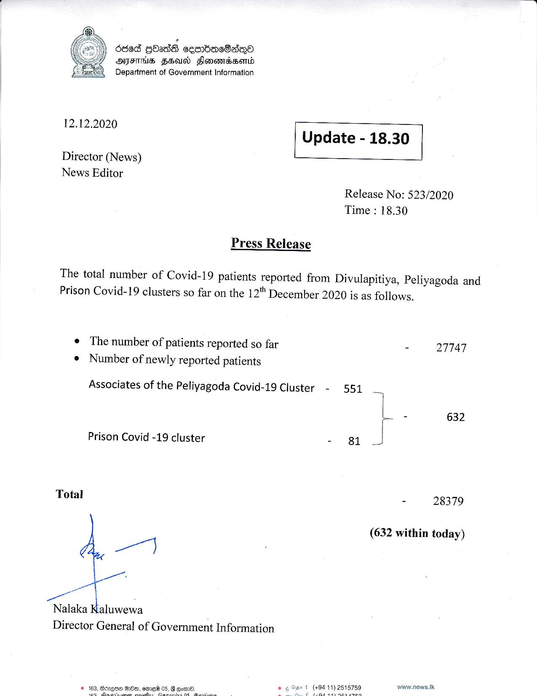

# Press Release - 2020.12.12 
Key: ecd6d0430d4d00628af9f13e95dfdcf9 

---
```
6865 GOAdS ceom=mbacBane
AFIS FAN Flonondssomd
Department of Government Information

12.12.2020 Update - 18.30

Director (News)
News Editor

 

 

Release No: 523/2020
Time : 18.30

Press Release

The total number of Covid-19 patients reported from Divulapitiya, Peliyagoda and
Prison Covid-19 clusters so far on the 12" December 2020 is as follows.

¢ The number of patients reported so far - 27747
¢ Number of newly reported patients

Associates of the Peliyagoda Covid-19 Cluster - 551 ~

L - 632

Prison Covid -19 cluster - 81

Total - 28379

(632 within today)

ml

ie

a

un
Nalaka Kaluwewa

Director General of Government Information

www.news.Ik

   

```
