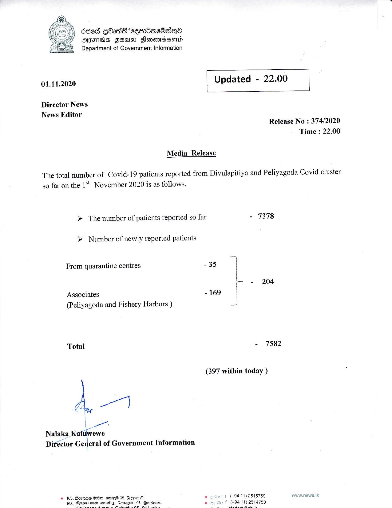

# Press Release - 2020.11.01 
Key: ed4e23d7059e77765d81acc9da37b947 

---
```
668 GHasdG cesrbaeBsn®
AIS FEU Fleoneniassew_d
Department of Government Information

 

 

01.11.2020 Updated - 22.00

 

 

 

Director News
News Editor

Release No : 374/2020

Media _ Release

Time : 22.00

The total number of Covid-19 patients reported from Divulapitiya and Peliyagoda Covid cluster

so far on the 1* November 2020 is as follows.

> The number of patients reported so far - 7378

> Number of newly reported patients

From quarantine centres - 35 |
p+ (204
Associates - 169 |
(Peliyagoda and Fishery Harbors ) pass
Total - 7582
(397 within today )

A)

igsane

Nalaka Kaluwewe
Director Caleta of Government Information

© 163, AdsQSH BHM, emeW8 05, 8 ows. 9 ¢ Gan t (49411) 2518759

   

 

```
