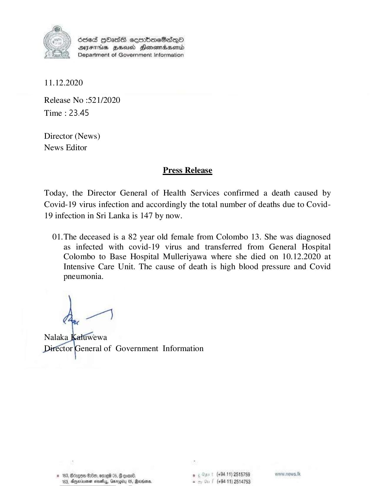

# Press Release - 2020.12.11 - Covid 19 infection deaths rises to 147 
Key: edbd8dc392b168e9eeeb44386be026fa 

---
```
| Stie5 HbasG semboneSadqQoO
DAYFHs BHU Honsmasenid
Department of Government Information

 

11.12.2020

Release No :521/2020
Time : 23.45

Director (News)
News Editor

Press Release

Today, the Director General of Health Services confirmed a death caused by
Covid-19 virus infection and accordingly the total number of deaths due to Covid-
19 infection in Sri Lanka is 147 by now.

01.The deceased is a 82 year old female from Colombo 13. She was diagnosed
as infected with covid-19 virus and transferred from General Hospital
Colombo to Base Hospital Mulleriyawa where she died on 10.12.2020 at
Intensive Care Unit. The cause of death is high blood pressure and Covid
pneumonia.

 

# 183, Benge 80, ove 0, @acan®. . (+84 11) 2515759 ww. news.
123, Aqerenen seedy, Gnregby OS, Maria . (+9411) 2514753

```
