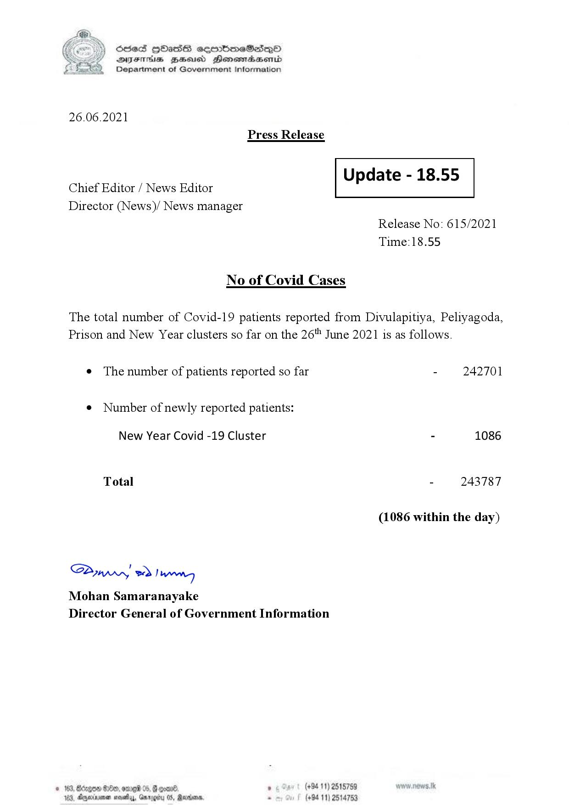

# Press Release - 2021.06.26 
Key: ee3ee41c556d83f6c3febfd839d18064 

---
```
S) ScseS HOasdS cerrbmeSdQo
DFTs BHEosd Henewtaeasernid
Department of Government Information

 

26.06.2021
Press Release

 

Update - 18.55

 

 

Chief Editor / News Editor
Director (News)/ News manager

 

Release No: 615/2021
Time:18.55

No of Covid Cases

The total number of Covid-19 patients reported from Divulapitiya, Peliyagoda,
Prison and New Year clusters so far on the 26" June 2021 is as follows.

e The number of patients reported so far - 242701

¢ Number of newly reported patients:

New Year Covid -19 Cluster - 1086

Total - 243787

(1086 within the day)

Saw 2) wn
Mohan Samaranayake
Director General of Government Information

° (+9411)
(+9411)

© 163, Bdrgon Ge, omred 05, g
183, Dmyerinsonen nesetyy, Gar

    

```
