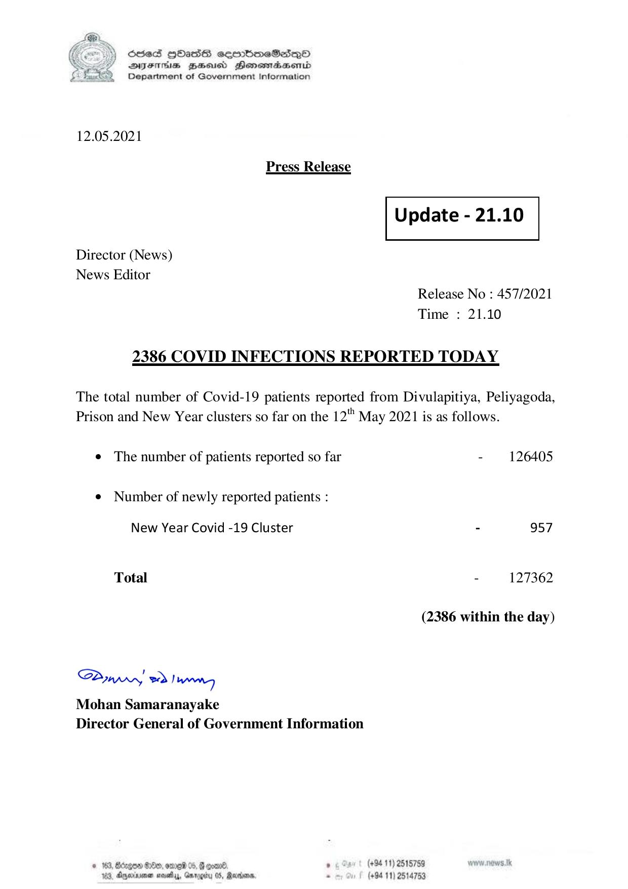

# Press Release - 2021.05.12 - Today Covid 19 infection report 
Key: ee527f954a34fbcd810763b1b1083c15 

---
```
) ScdeS HOadS cermbmeSsdQo
SUES Zeid Henesrdaembd
Department of Government Information

 

12.05.2021

Press Release

 

Update - 21.10

 

 

 

Director (News)
News Editor

Release No : 457/2021
Time : 21.10

2386 COVID INFECTIONS REPORTED TODAY

The total number of Covid-19 patients reported from Divulapitiya, Peliyagoda,
Prison and New Year clusters so far on the 12" May 2021 is as follows.

e The number of patients reported so far - 126405

¢ Number of newly reported patients :

New Year Covid -19 Cluster - 957
Total - 127362
(2386 within the day)

SPywwwy Iwan
Mohan Samaranayake
Director General of Government Information

© 163,

 

0% @Dd9, e119 06, @ evan ° (+94 11) 2515789
meinen mots, Gurogiy 05, adm, . (+94 11) 2514753

 

183

```
