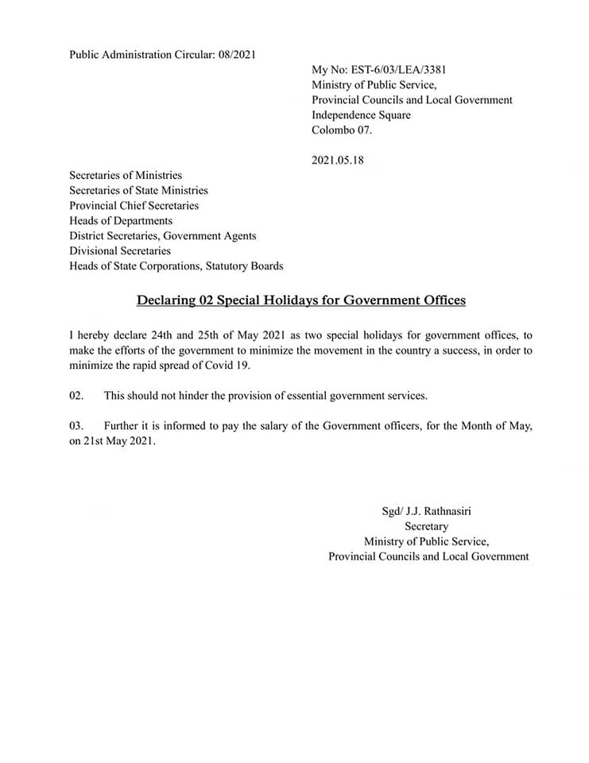

# Press Release - 2021.05.18 - Declaring 02 Special Holidays for Government Offices 
Key: ee9ec41ea3313972604db38b073033fe 

---
```
Public Administration Circular: 08/2021
My No: EST-6/03/LEA/3381
Ministry of Public Service,
Provincial Councils and Local Government
Independence Square
Colombo 07.

2021.05.18
Secretaries of Ministries
Secretaries of State Ministries
Provincial Chief Secretaries
Heads of Departments
District Secretaries, Government Agents
Divisional Secretaries
Heads of State Corporations, Statutory Boards

 

Declaring 02 Special Holidays for Government Offic:

Thereby declare 24th and 25th of May 2021 as two special holidays for government offices, to
make the efforts of the government to minimize the movement in the country a success, in order to
minimize the rapid spread of Covid 19.

 

02. This should not hinder the provision of essential government services,

03. Further itis informed to pay the salary of the Government officers, for the Month of May,
‘on 21st May 2021.

Sed/J.J. Rathnasiti
Secretary
Ministry of Public Service,
Provincial Councils and Local Government

```
