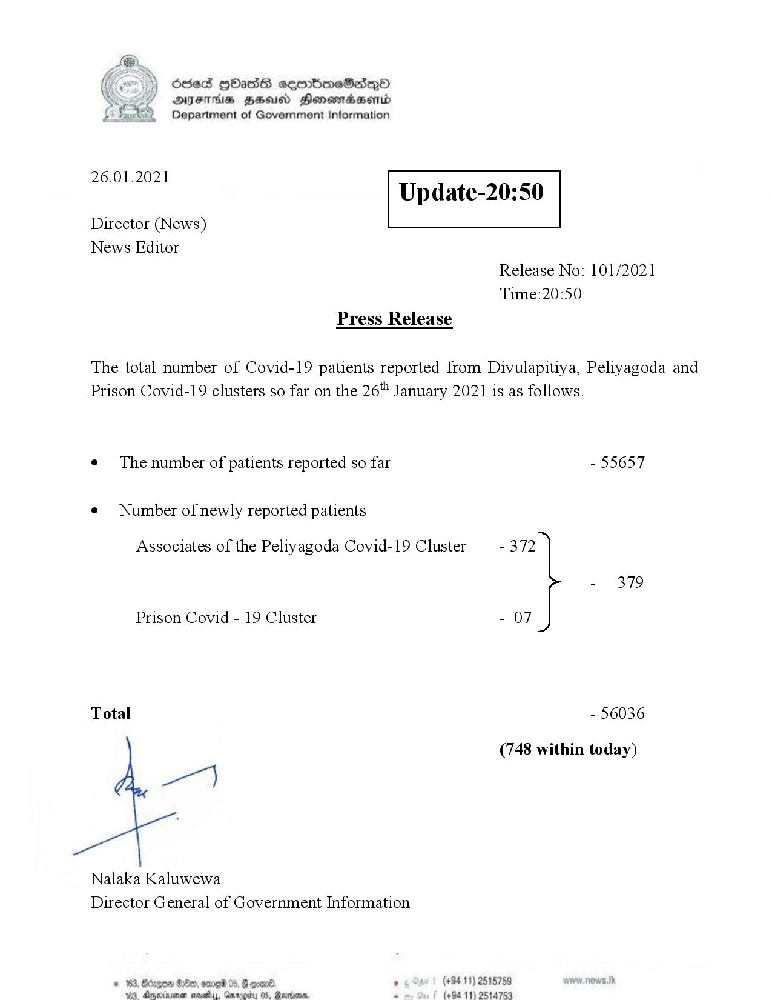

# Press Release - 2021.01.26 
Key: eedaa3a622d32d6b1cb0cfb0b828fd53 

---
```
>) Sed HOadS ceorbmeSedeQ®
DAIS BHU Honomasentd
Department of Government Information

 

 

26.01.2021

Update-20:50

 

 

 

Director (News)
News Editor
Release No: 101/2021
Time:20:50
Press Release

The total number of Covid-19 patients reported from Divulapitiya, Peliyagoda and
Prison Covid-19 clusters so far on the 26" January 2021 is as follows.
e¢ The number of patients reported so far - 55657

¢ Number of newly reported patients

Associates of the Peliyagoda Covid-19 Cluster - 372

- 379
Prison Covid - 19 Cluster - 07
Total - 56036
(748 within today)

ey

Nalaka Kaluwewa
Director General of Government Information

’ (+94 11) 2515759
‘@axbms. : (494 11) 2514753

 
  

© 163, Bdge GOe, ome 05, G oom,
183 Xnenen sevettay, Garage

  

```
