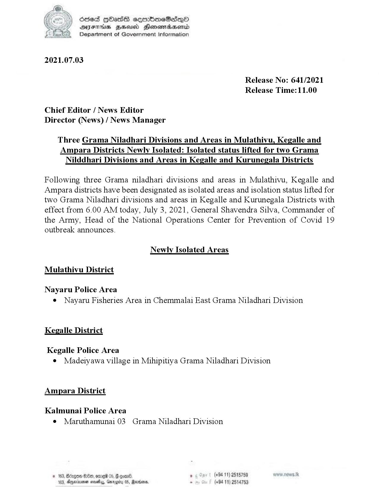

# Press Release - 2021.07.03 - Isolated lifting areas and newly isolated areas 
Key: efc8066c1dbe365ea4aa7fd38f49a332 

---
```
fi ) écied HAaSS ceerbmeSedeqQ0
DFS HSE Honowradsenrd
Department of Government Information

 

 

2021.07.03

Release No: 641/2021
Release Time:11.00

Chief Editor / News Editor
Director (News) / News Manager

Three Grama Niladhari Divisions and Areas in Mulathivu, Kegalle and
Ampara Districts Newly Isolated: Isolated status lifted for two Grama
Nilddhari Divisions and Areas in Kegalle and Kurunegala Districts

Following three Grama niladhari divisions and areas in Mulathivu, Kegalle and
Ampara districts have been designated as isolated areas and isolation status lifted for
two Grama Niladhari divisions and areas in Kegalle and Kurunegala Districts with
effect from 6.00 AM today, July 3, 2021, General Shavendra Silva, Commander of
the Army, Head of the National Operations Center for Prevention of Covid 19
outbreak announces.

Newly Isolated Areas
Mulathivu District

Nayaru Police Area
e Nayaru Fisheries Area in Chemmalai East Grama Niladhari Division

Kegalle District

Kegalle Police Area
e Madeiyawa village in Mihipitiya Grama Niladhari Division

Ampara District

Kalmunai Police Area
e Maruthamunai 03 Grama Niladhari Division

. +94 11) 2515759
(+94 11) 2514753

 

```
