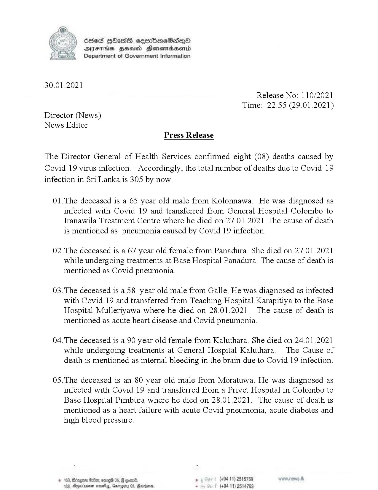

# Press Release - 2021.01.29 - Covid 19 infection deaths 
Key: f03e1b5cd541ff7a2c62f6d28cbfd367 

---
```
(ii ) Sled HOAsdS ceerbneSedQo
8 Y DAYFrhs ZH Honemadsentd
Department of Government Information

 

30.01.2021
Release No: 110/2021
Time: 22.55 (29.01.2021)

Director (News)
News Editor
Press Release

The Director General of Health Services confirmed eight (08) deaths caused by
Covid-19 virus infection. Accordingly, the total number of deaths due to Covid-19
infection in Sri Lanka is 305 by now.

01.The deceased is a 65 year old male from Kolonnawa. He was diagnosed as
infected with Covid 19 and transferred from General Hospital Colombo to
Iranawila Treatment Centre where he died on 27.01.2021 The cause of death
is mentioned as pneumonia caused by Covid 19 infection.

02.The deceased is a 67 year old female from Panadura. She died on 27.01.2021
while undergoing treatments at Base Hospital Panadura. The cause of death is
mentioned as Covid pneumonia.

03.The deceased is a 58 year old male from Galle. He was diagnosed as infected
with Covid 19 and transferred from Teaching Hospital Karapitiya to the Base
Hospital Mullertyawa where he died on 28.01.2021. The cause of death is
mentioned as acute heart disease and Covid pneumonia.

04. The deceased is a 90 year old female from Kaluthara. She died on 24.01.2021
while undergoing treatments at General Hospital Kaluthara. The Cause of
death is mentioned as internal bleeding in the brain due to Covid 19 infection.

05.The deceased is an 80 year old male from Moratuwa. He was diagnosed as
infected with Covid 19 and transferred from a Privet Hospital in Colombo to
Base Hospital Pimbura where he died on 28.01.2021. The cause of death is
mentioned as a heart failure with acute Covid pneumonia, acute diabetes and

 

high blood pressure.
© 163, Bdnges ©2840, ome 05, ° (+94 11) 2515789
163, Aerie navetys, Gary (+94 11) 2514753

 

```
