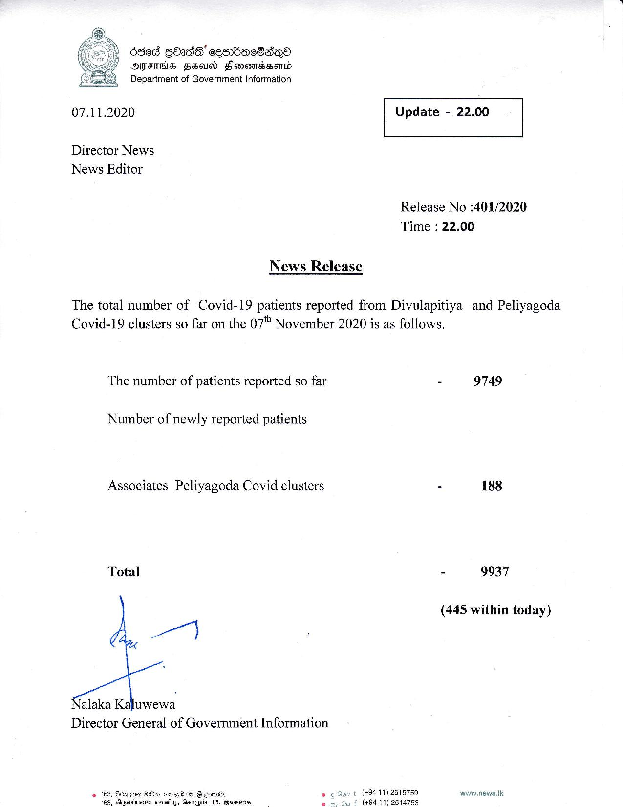

# Press Release - 2020.11.07 
Key: f0ce770a63eb5880076ce48e71c2520e 

---
```
Osed GOad8' ceenbacdadnQoa
AFIS FH FHlonevressHerid
Department of Government Information

 

 

07.11.2020 Update - 22.00

 

 

 

Director News
News Editor

Release No :401/2020
Time : 22.00

News Release

The total number of Covid-19 patients reported from Divulapitiya and Peliyagoda
Covid-19 clusters so far on the 07" November 2020 is as follows.

The number of patients reported so far

Number of newly reported patients

Associates Peliyagoda Covid clusters

Total

Nalaka Kaluwewa
Director General of Government Information

 
 

(+94 11) 2515759
(+94 11) 2514753

2 163, Bcxqne GOm, eme® 05, 8 gone
dy 05, Baorkianes,

 

9749

- 188

- 9937

(445 within today)

wwnw.news.Ik.

```
