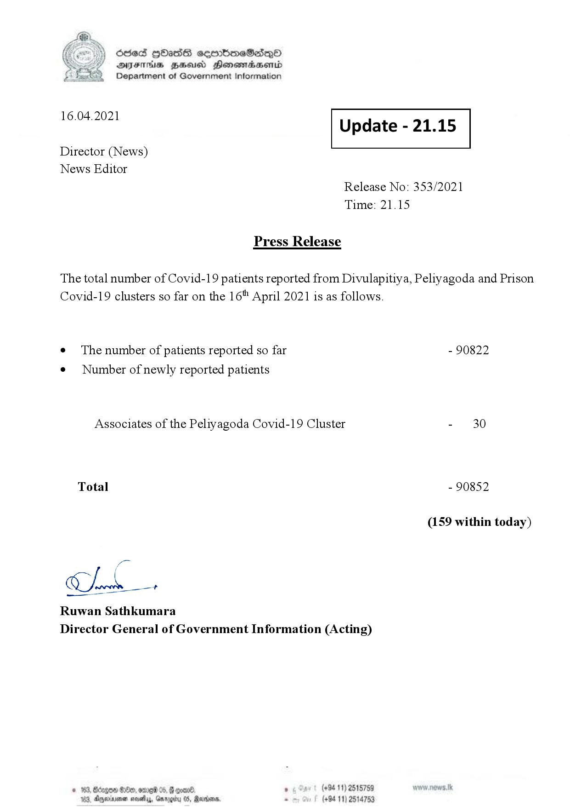

# Press Release - 2021.04.16 
Key: f11893627f234b8a30af453d1d8797ab 

---
```
\) O63 GOadS ceortimeSzdQO
AIFS BHU Henewmadasentd
Department of Government Information

 

 

16.04.2021 Update - 21.15

 

 

 

Director (News)

News Editor
Release No: 353/2021
Time: 21.15

Press Release

The total number of Covid-19 patients reported from Divulapitiya, Peliyagoda and Prison
Covid-19 clusters so far on the 16" April 2021 is as follows.

e The number of patients reported so far - 90822

¢ Number of newly reported patients

Associates of the Peliyagoda Covid-19 Cluster - 30
Total - 90852
(159 within today)

CLA.

Ruwan Sathkumara
Director General of Government Information (Acting)

© 163, degen 0, ore 05, @ goand ° (+94 11) 2515759
163, Aparna nasty, Garogiry 0S, Rerrioare, . (+94 11) 2514753

```
