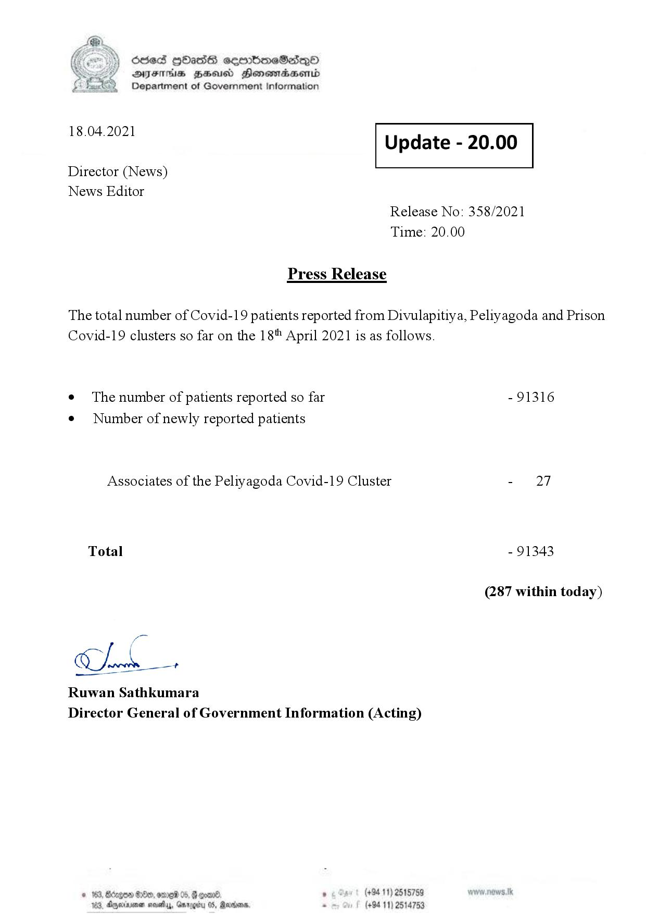

# Press Release - 2021.04.18 
Key: f1b6b03ab2f2eb9e1fc11718e5ebde01 

---
```
\) O63 GOadS ceortimeSzdQO
AIFS BHU Henewmadasentd
Department of Government Information

 

 

18.04.2021 Update - 20.00

 

 

 

Director (News)

News Editor
Release No: 358/2021
Time: 20.00

Press Release

The total number of Covid-19 patients reported from Divulapitiya, Peliyagoda and Prison
Covid-19 clusters so far on the 18" April 2021 is as follows.

e¢ The number of patients reported so far - 91316
¢ Number of newly reported patients

Associates of the Peliyagoda Covid-19 Cluster - 27
Total - 91343
(287 within today)

CLL.

Ruwan Sathkumara
Director General of Government Information (Acting)

© 163, degen 0, ore 05, @ goand ° (+94 11) 2515759
163, Aparna nasty, Garogiry 0S, Rerrioare, . (+94 11) 2514753

```
