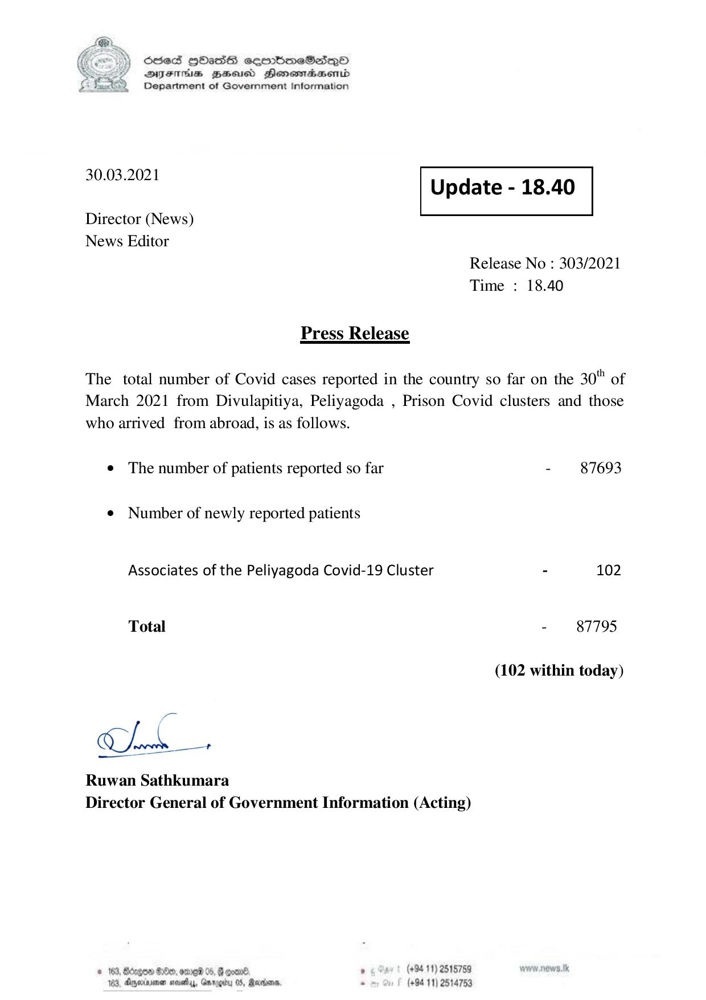

# Press Release - 2021.03.30 
Key: f1cbc811aff73187f4bd7d42f05e8ca3 

---
```
) ScdeS HOadS cermbmeSsdQo
DVEFIHS HHosd Honomabsenid
Department of Government Information

 

 

30.03.2021 Update - 18.40

 

 

 

Director (News)
News Editor

Release No : 303/2021
Time : 18.40

Press Release

The total number of Covid cases reported in the country so far on the 30" of
March 2021 from Divulapitiya, Peliyagoda , Prison Covid clusters and those

who arrived from abroad, is as follows.
¢ The number of patients reported so far

¢ Number of newly reported patients

Associates of the Peliyagoda Covid-19 Cluster

Total

a=

Mok x

Ruwan Sathkumara
Director General of Government Information (Acting)

. (+94 11) 2515789

2 89, ong 05, G coar®.
(+94 11) 2514753

a nest, Gn

      

- 87693

- 102

- 87795

(102 within today)

```
