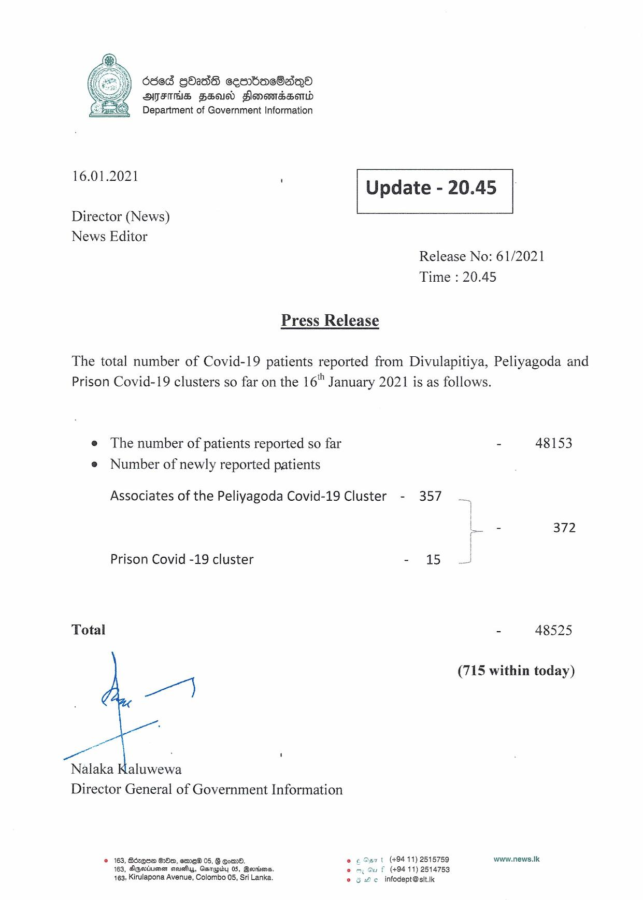

# Press Release - 2021.01.16 
Key: f1d7905d9edb107d7fc464bf560154a2 

---
```
636d GOadd cesnbac8sqQo
AFIS FED Slonomdsond
Department of Government Information

 

 

16.01.2021 '

 

Update - 20.45

 

 

Director (News)
News Editor

Release No: 61/2021

Time

Press Release

220.45

The total number of Covid-19 patients reported from Divulapitiya, Peliyagoda and
Prison Covid-19 clusters so far on the 16" January 2021 is as follows.

e The number of patients reported so far
© Number of newly reported patients

Associates of the Peliyagoda Covid-19 Cluster - 357

Prison Covid -19 cluster - 15

Total

ae)

er ‘ ‘

Nalaka Kaluwewa
Director General of Government Information

© 163, Bdzqow Gre, sme 05, G oom. © ¢ Gant (+94 11) 2515759
168, SGwvineen acveys, Garepidy 05, Berries. © = ou f (494 11) 2514753
+163, Kirulapona Avenue, Colombo 05, Sri Lanka © 6 He infodept@sit.k

- 48153

a 372

- 48525

(715 within today)

www.news.Ik

```
