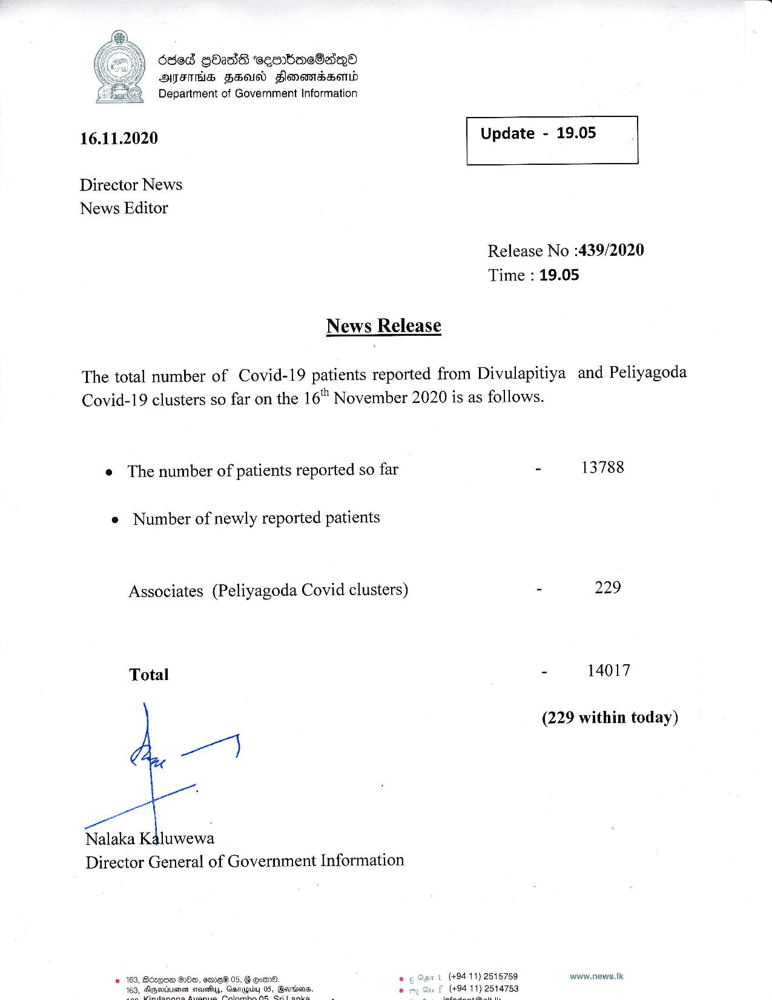

# Press Release - 2020.11.16 
Key: f1ed99e0875bb1547610564ce3196964 

---
```
686d gbadd eeorbac8aqQe
HAH FHI FlonomdsomLd
Department of Government Information

16.11.2020

Director News
News Editor

Release No :439/2020
Time : 19.05

News Release

The total number of Covid-19 patients reported from Divulapitiya and Peliyagoda
Covid-19 clusters so far on the 16 November 2020 is as follows.

e The number of patients reported so far

 

```
