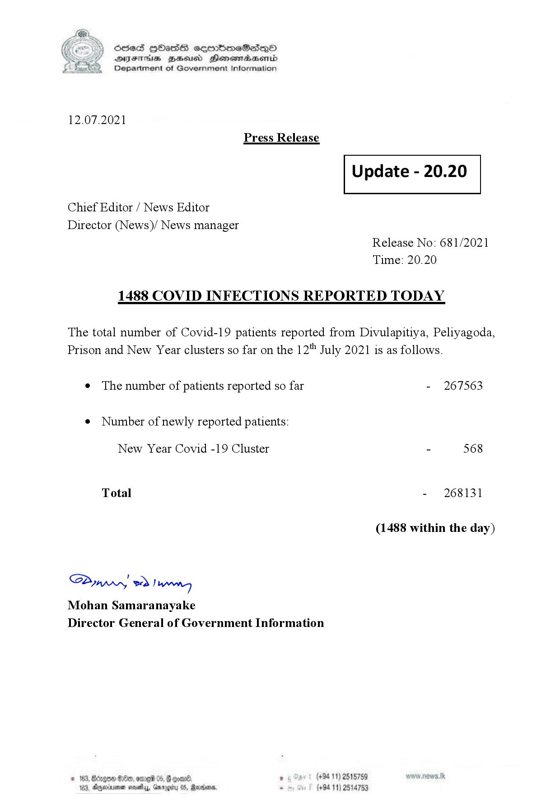

# Press Release - 2021.07.12 - Covid 19 inection report 
Key: f222418f000ba2f89b6631ab585ba865 

---
```
(6 S) ScseS HOasdS cerrbmeSdQo
DFTs BHEosd Henewtaeasernid
Department of Government Information

 

12.07.2021
Press Release

Chief Editor / News Editor
Director (News)/ News manager

 

 

Update - 20.20

 

 

Release No: 681/2021
Time: 20.20

1488 COVID INFECTIONS REPORTED TODAY

The total number of Covid-19 patients reported from Divulapitiya, Peliyagoda,
Prison and New Year clusters so far on the 12" July 2021 is as follows.

e The number of patients reported so far

¢ Number of newly reported patients:

New Year Covid -19 Cluster

Total

Saw 2) won,
Mohan Samaranayake
Director General of Government Information

© 163, ong

 

SOx, onred 05. § oom .

- 267563

- 568

- 268131

(1488 within the day)

(+94 11) 2515759

103, Ageinvemen wos, Garg 05, Randers. . (+94 11) 2514753

```
