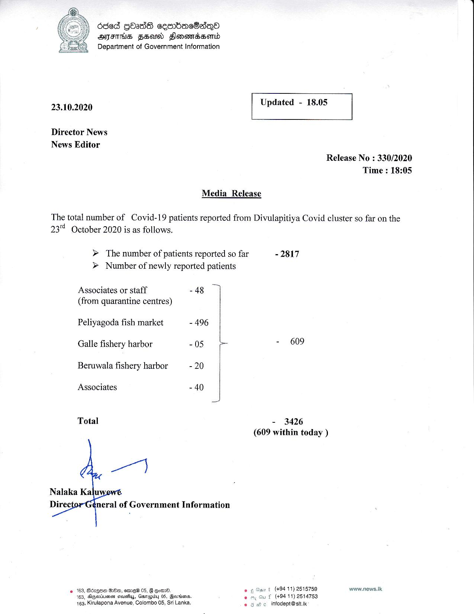

# Press Release -2020.10.23 
Key: f28a50742a201bc7298df2e70b06b252 

---
```
O8ed GOzdS cesnbacOaqQo
ATITHS FSald Flonanssond
Department of Government Information

 

 

23.10.2020 Updated - 18.05

 

 

 

Director News
News Editor
Release No : 330/2020
Time : 18:05

Media Release

The total number of Covid-19 patients reported from Divulapitiya Covid cluster so far on the
23" October 2020 is as follows.

> The number of patients reported so far -2817
> Number of newly reported patients

Associates or staff - 48
(from quarantine centres)

Peliyagoda fish market - 496
Galle fishery harbor - 05 L - 609
Beruwala fishery harbor -20 |
Associates - 40 |
Total - 3426

(609 within today )

 

+ (494 11) 2815759 www.news.Ik
(+94 11) 2514753
infodept@stt.1k

© 163, BdzqQue HH, eme® 05, G Oow08. .
163, SkGsrivereH stausfiys, Gamapiby 05, Berrien. %
163, Kirulapona Avenue, Colombo 05, Sri Lanka.

 

 

 

```
