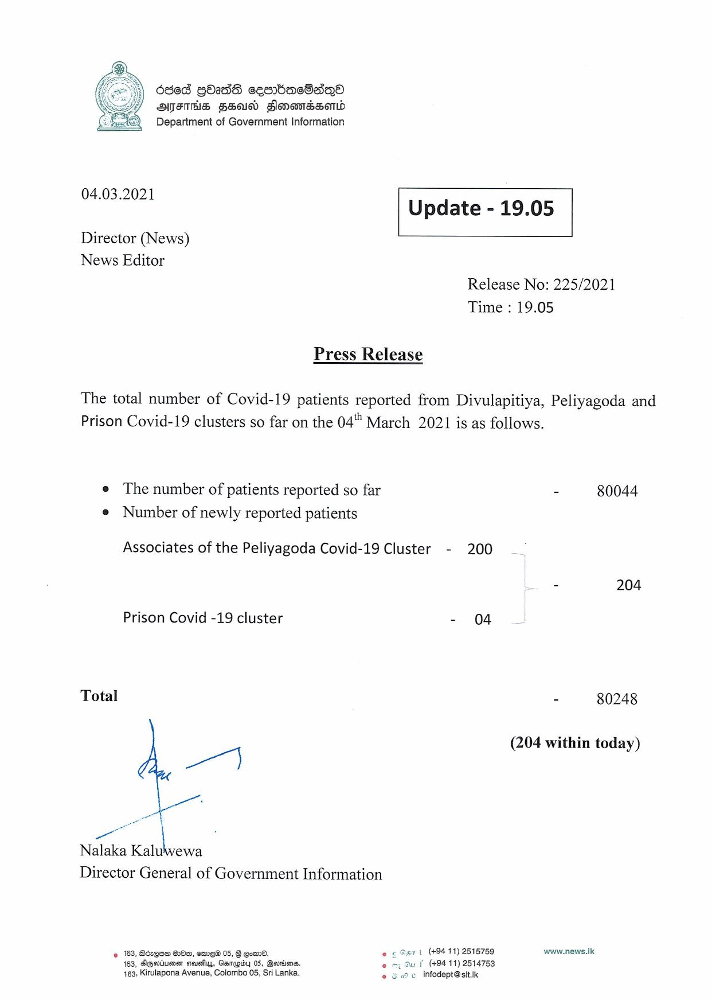

# Press Release - 2021.03.04 
Key: f34b327646871e8d17cc4fe6e6835071 

---
```
6865 GO2dS cesbacOsqQeo
AFIS FUN Flonomassond
Department of Government Information

 

 

04.03.2021 Update - 19.05

 

 

 

Director (News)
News Editor

Release No: 225/2021
Time : 19.05

Press Release

The total number of Covid-19 patients reported from Divulapitiya, Peliyagoda and
Prison Covid-19 clusters so far on the 04° March 2021 is as follows.

e The number of patients reported so far - 80044
e Number of newly reported patients

Associates of the Peliyagoda Covid-19 Cluster - 200

= 204

Prison Covid -19 cluster - 04

Total - 80248

(204 within today)

er]

ae
Nalaka Kaluwewa

Director General of Government Information

© 163, Bézque 20m, emre® 05, G Eo. fe © Osx t (49411) 2515759 www.news.Ik
163, AGaiusen seus, Genapbdy 05, Berdiens. 1 (+9411) 2514753
163, Kirulapona Avenue, Colombo 05, Sri Lanka. eo & we infodept@sit.ik

 

```
