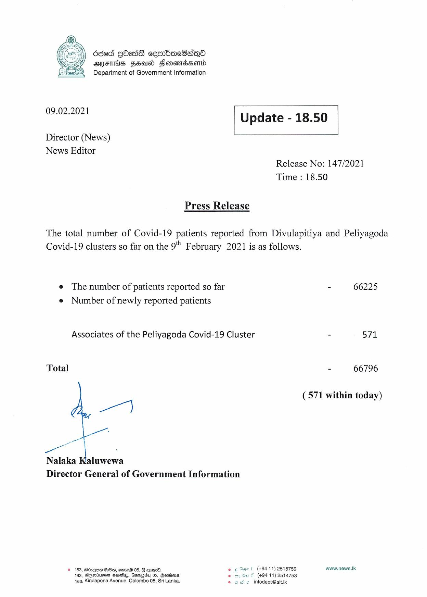

# Press Release - 2021.02.09 
Key: f38ca708f3e45ae102a14f4216c48754 

---
```
dded GOaddS cesmbacO8a~Qo
AIITHS FEU Flomomassontd
Department of Government Information

 

 

09.02.2021 Update - 18.50

 

 

 

Director (News)

News Editor
Release No: 147/2021
Time : 18.50

Press Release

The total number of Covid-19 patients reported from Divulapitiya and Peliyagoda
Covid-19 clusters so far on the 9" February 2021 is as follows.

e The number of patients reported so far - 66225
e Number of newly reported patients

Associates of the Peliyagoda Covid-19 Cluster - 571

Total - 66796

(571 within today)

we]
ae

gor
Nalaka Kaluwewa

Director General of Government Information

© 163, Bézque 200, eme® 05, G eomd. eS t (+9411) 2518759 www.news.Ik
163, HGsviiumen seuss, Ganapidy 05, Bovnions. © my Su f (49411) 2514753
4163, Kirulapona Avenue, Colombo 05, Sri Lanka, © oe infodept@stt.k

```
