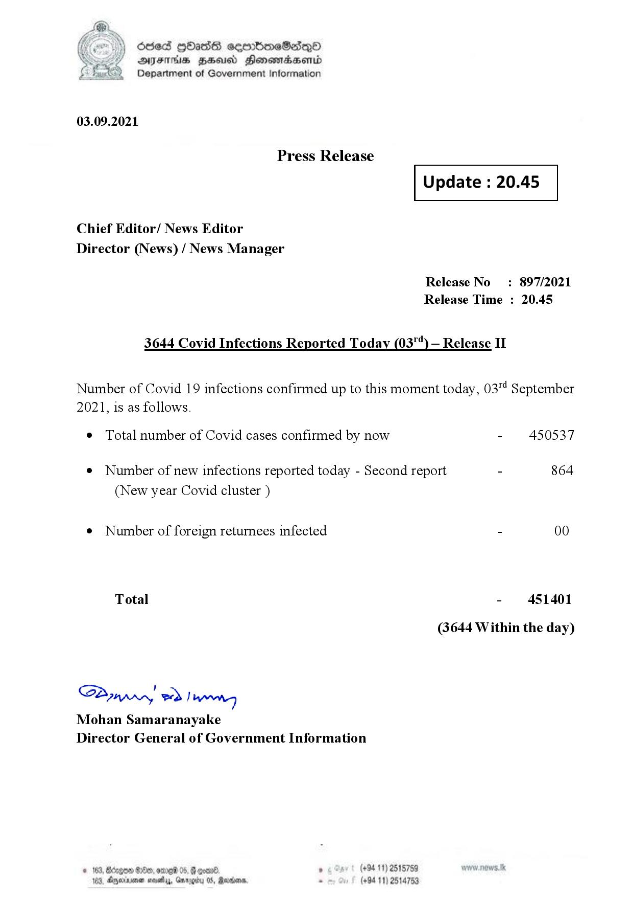

# Press Release - 2021.09.03 - Covid 19 Infection Report 
Key: f3ff78b009ef8e7f665d2fffa929ca12 

---
```
dosed GOass eemmbmeSadepO
DFS BHU Honswnradasentd
Department of Government Information

 

 

03.09.2021

Press Release

Chief Editor/ News Editor
Director (News) / News Manager

 

 

Update : 20.45

 

 

Release No: 897/2021
Release Time : 20.45

3644 Covid Infections Reported Today (03"')— Release II

Number of Covid 19 infections confirmed up to this moment today, 03"! September

2021, is as follows.

¢ Total number of Covid cases confirmed by now

¢ Number of new infections reported today - Second report

(New year Covid cluster )

¢ Number of foreign returnees infected

Total

SPynprn wd Ing
Mohan Samaranayake
Director General of Government Information

  

© 163, Bdagon Oo, ome

6 * (+94 11) 2515759
103, Ajerinenen mosey, arog 08, Marion . (+94 11) 2514753

- 450537

864

- 451401
(3644 Within the day)

```
