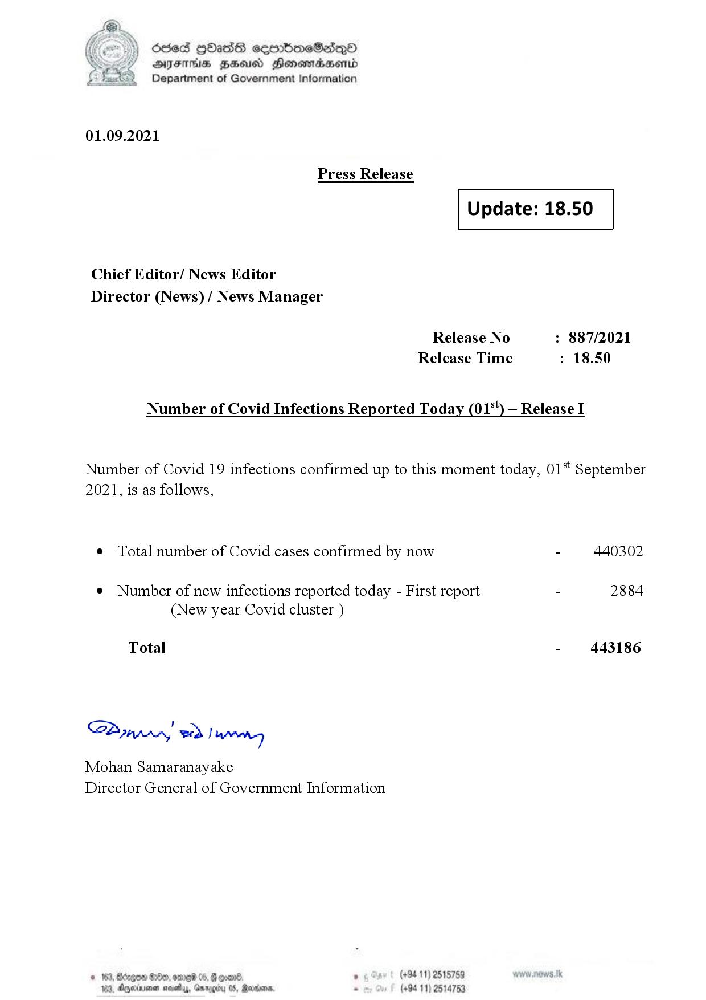

# Press Release - 2021.09.01 
Key: f40980cec5c7fa5a8a8145e14315d83c 

---
```
(2) Oded QOasS cseenboeSiqQo
DFS HHS Honsmnadaerntd
Department of Government Information

 

01.09.2021

Press Release

 

Update: 18.50

 

 

 

Chief Editor/ News Editor
Director (News) / News Manager

Release No : 887/2021
Release Time : 18.50

Number of Covid Infections Reported Today (01) — Release I

Number of Covid 19 infections confirmed up to this moment today, 01 September
2021, is as follows,

¢ Total number of Covid cases confirmed by now - 440302

¢ Number of new infections reported today - First report - 2884
(New year Covid cluster )

Total - 443186

SB, eed | Mens

Mohan Samaranayake
Director General of Government Information

   

188, Anexivenan noes, Garogiy 05, Mardoorn,

```
