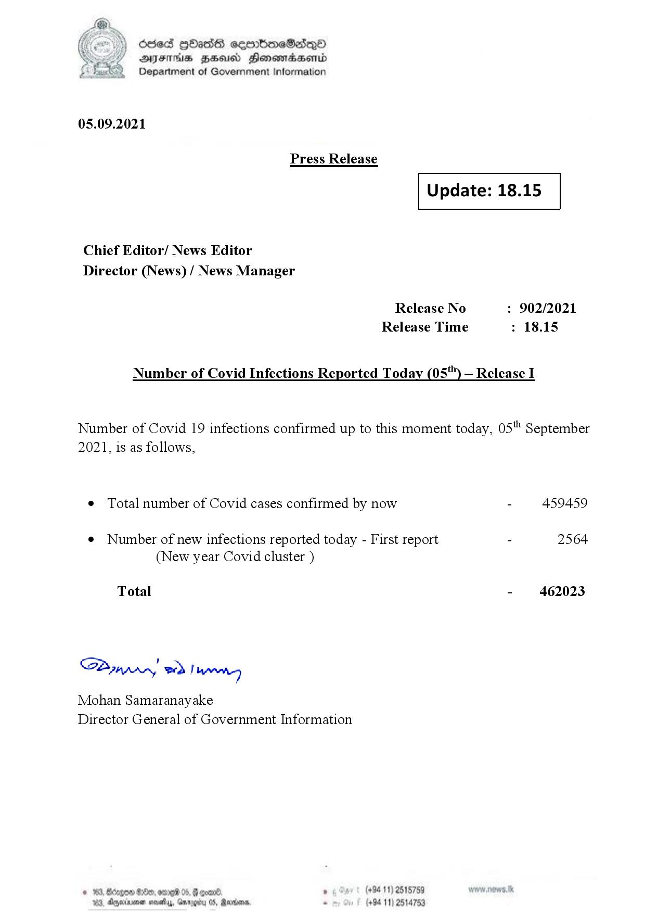

# Press Release - 2021.09.05 
Key: f48aa286a4700a3a8af977632d654b1c 

---
```
(i) Oded QOass seenboeSaiQo
DFS HHS Honsmnadaerntd
Department of Government Information

 

05.09.2021

Press Release

 

Update: 18.15

 

 

 

Chief Editor/ News Editor
Director (News) / News Manager

Release No : 902/2021
Release Time : 18.15

Number of Covid Infections Reported Today (05") — Release I

Number of Covid 19 infections confirmed up to this moment today, 05" September
2021, is as follows,

¢ Total number of Covid cases confirmed by now - 459459

¢ Number of new infections reported today - First report - 2564
(New year Covid cluster )

Total - 462023

Bunn, eed | Manes

Mohan Samaranayake
Director General of Government Information

   

188, Anexivenan noes, Garogiy 05, Mardoorn,

```
