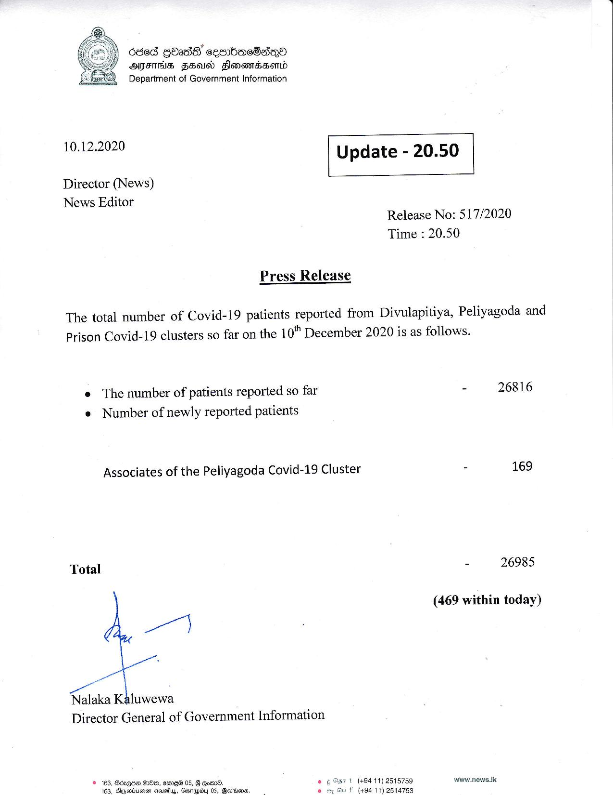

# Press Release - 2020.12.10 
Key: f49f627e28da4a6287fed21eddc58a81 

---
```
odes gbade GEMEMEOSRO
AJIT FHA Flonanssomd
Department of Government Information

 

 

10.12.2020 Update - 20.50

 

 

 

Director (News)
News Editor

Release No: 517/2020
Time : 20.50

Press Release

The total number of Covid-19 patients reported from Divulapitiya, Peliyagoda and
Prison Covid-19 clusters so far on the 10°" December 2020 is as follows.

e The number of patients reported so far
e Number of newly reported patients

Associates of the Peliyagoda Covid-19 Cluster

Total

we

_

at
Nalaka Kaluwewa
Director General of Government Information

© 163, Bogue HB, erme® 05, B own. © ¢ Sst (+0411) 2515759
163, Ameria cteuefluy, Guerrapidy 05, Bevwiens. . £ (49411) 2514753

 

- 26816

- 169

- 26985

(469 within today)

www.news.tk

```
