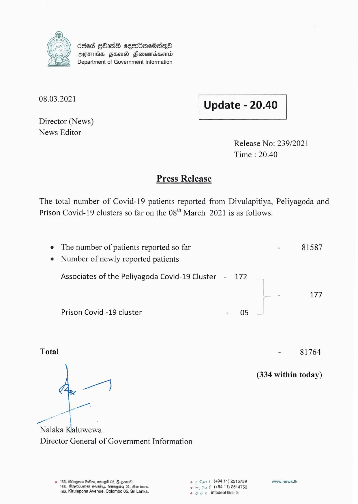

# Press Release - 2021.03.08 
Key: f4b39baa1e68cbcf1e19666ec65328e5 

---
```
dded QOadG cemmbacOasqQoO
AFIS FEN Flonomassomd
Department of Government Information

 

 

08.03.2021 Update - 20.40

 

 

 

Director (News)
News Editor

Release No: 239/2021
Time : 20.40

Press Release

The total number of Covid-19 patients reported from Divulapitiya, Peliyagoda and
Prison Covid-19 clusters so far on the 08" March 2021 is as follows.

e The number of patients reported so far - 81587
e Number of newly reported patients

Associates of the Peliyagoda Covid-19 Cluster - 172

- 177

Prison Covid -19 cluster - 05

Total - 81764

- (334 within today)
a

Nalaka ee
Director General of Government Information

© 163, B6zQom 8:80, ome 05, 8 com. eo «Sart (+9411) 2515759 www.news.lk
163, Ageviiuensn suey, Garapidy 05, Berrina. au f (+94 11) 2514753
163, Kirulapona Avenue, Colombo 05, Sri Lanka. © © 6 infodept@sit.k

 

```
