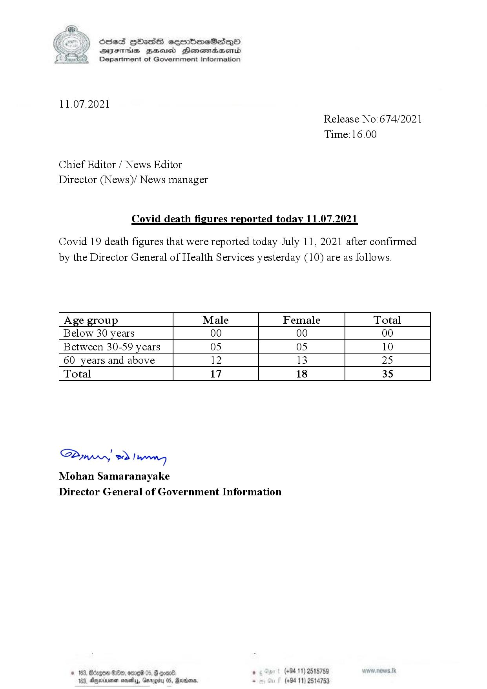

# Press Release - 2021.07.11 - Covid 19 infection deaths 
Key: f50d4bb33c7fe86d80524025d65f997d 

---
```
(6 ) dcsed HbHass cermbm~eSadeQo
S DIsFHsS BHsusd Henewmiaaentd
Department of Government Information

 

11.07.2021
Release No:674/2021

Time: 16.00

Chief Editor / News Editor
Director (News)/ News manager

Covid death figures reported today 11.07.2021

Covid 19 death figures that were reported today July 11, 2021 after confirmed
by the Director General of Health Services yesterday (10) are as follows.

 

 

 

 

 

Age group Male Female Total
Below 30 years 00 00 00
Between 30-59 years 05 05 10
60 years and above 12 13 25
Total 17 18 35

 

 

 

 

 

 

SP od Ianwng
Mohan Samaranayake
Director General of Government Information

NED 0 06) . (+94 11) 2515759
44, Gargtty 05, Martone, . (+94 11) 2514753

   

3, Agerniean s

```
