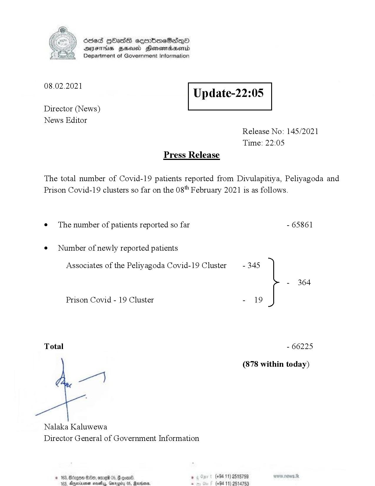

# Press Release - 2021.02.08 
Key: f60f316ff68b1eec81d40fcc5d1921b1 

---
```
>) Sed HOadS ceorbmeSedeQ®
DAIS BHU Honomasentd
Department of Government Information

 

 

08.02.2021

Update-22:05

 

 

 

Director (News)
News Editor
Release No: 145/2021
Time: 22:05
Press Release

The total number of Covid-19 patients reported from Divulapitiya, Peliyagoda and
Prison Covid-19 clusters so far on the 08" February 2021 is as follows.
e¢ The number of patients reported so far - 65861

¢ Number of newly reported patients

Associates of the Peliyagoda Covid-19 Cluster - 345

- 364
Prison Covid - 19 Cluster - 19
Total - 66225
(878 within today)

ey

Nalaka Kaluwewa
Director General of Government Information

. (+94 11) 2515789
(+94 11) 2514753

 

```
