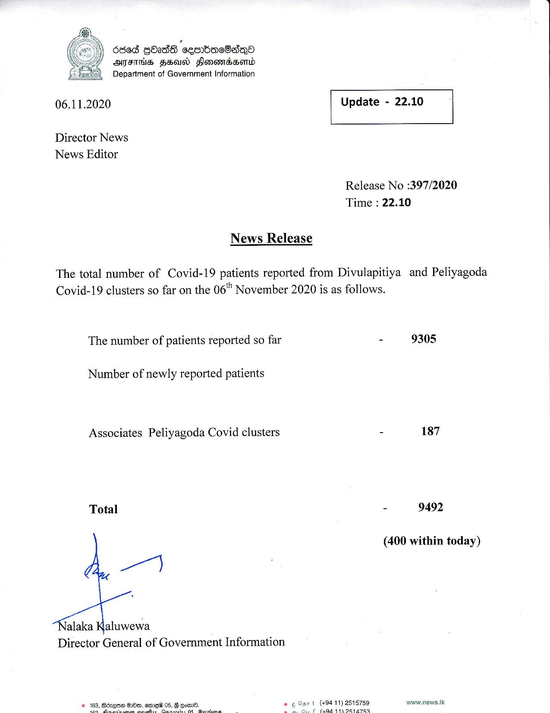

# Press Release - 2020.11.06 
Key: f700bb1af6ae7888979e25a72f737646 

---
```
686d Gbadh cembac8aqQo
ATFTHS FSD Slenowmidsenld
Department of Government Information

 

 

06.11.2020 Update - 22.10

 

 

 

Director News
News Editor

Release No :397/2020
Time : 22.10

News Release

The total number of Covid-19 patients reported from Divulapitiya and Peliyagoda
Covid-19 clusters so far on the 06" November 2020 is as follows.

The number of patients reported so far - 9305

Number of newly reported patients

Associates Peliyagoda Covid clusters - 187
Total - 9492
(400 within today)

my

alaka Kaluwewa
Director General of Government Information

 

t (+94 11) 2515759 www.news.lk
€ (404-74) D147 RQ

 

 

```
