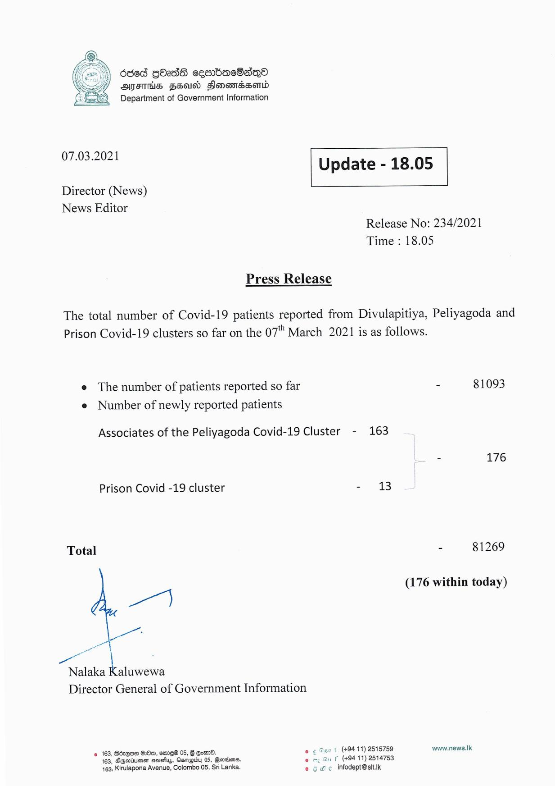

# Press Release - 2021.03.07 
Key: f72b30d6fee7ee6905c007bcbefc56c4 

---
```
deed GOS cemmbacOaqQo
OFTHIS FEUD Hlonemedsontd
Department of Government Information

 

 

07.03.2021 Update - 18.05

 

 

Director (News)
News Editor

 

Release No: 234/2021
Time : 18.05

Press Release

The total number of Covid-19 patients reported from Divulapitiya, Peliyagoda and
Prison Covid-19 clusters so far on the 07" March 2021 is as follows.

e The number of patients reported so far - 81093
e Number of newly reported patients

Associates of the Peliyagoda Covid-19 Cluster - 163

= 176

Prison Covid -19 cluster - 13

Total - 81269

(176 within today)

Pa

a L .
Nalaka Kaluwewa

Director General of Government Information

9 163, BozqUD D0, ore 05, G orm. oe Sart (+9411) 2515759 www.news.Ik
163, AGeiume saiehys, Canapiby 05, Rooters. eo = Gu f (+94 11) 2514753
463, Kirulapona Avenue, Colombo 05, Sri Lanka. © 6 wc  Infodept@stt.k

```
