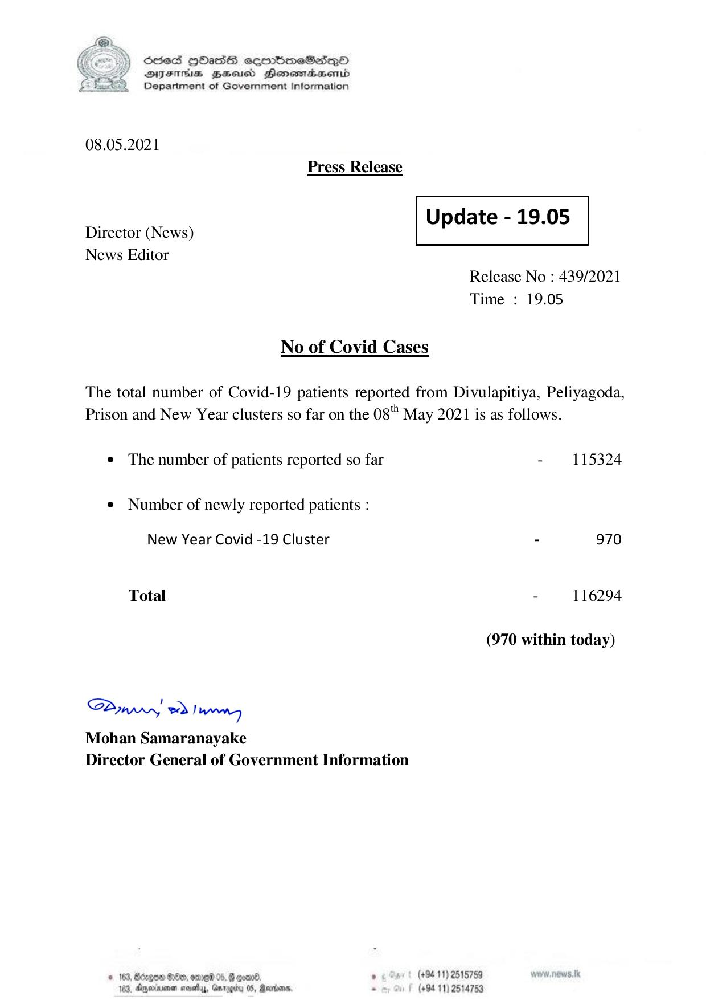

# Press Release - 2021.05.08 
Key: f76390f2c54f613040268b409b5e1cf1 

---
```
) ScdeS HOadS cermbmeSsdQo
DVEFIHS HHosd Honomabsenid
Department of Government Information

 

08.05.2021
Press Release

 

Update - 19.05

 

 

Director (News)
News Editor

 

Release No : 439/2021
Time : 19.05

No of Covid Cases

The total number of Covid-19 patients reported from Divulapitiya, Peliyagoda,
Prison and New Year clusters so far on the 08" May 2021 is as follows.

¢ The number of patients reported so far - 115324

¢ Number of newly reported patients :

New Year Covid -19 Cluster - 970
Total - 116294
(970 within today)

Saw 2) wong

Mohan Samaranayake
Director General of Government Information

© 162; Bcapo0 €:80, ene 05, 8 cxene ‘ (+94 11) 2518759
163, Ageiune neatly, Gargity 05, Rann. - (+94 11) 2514753

```
