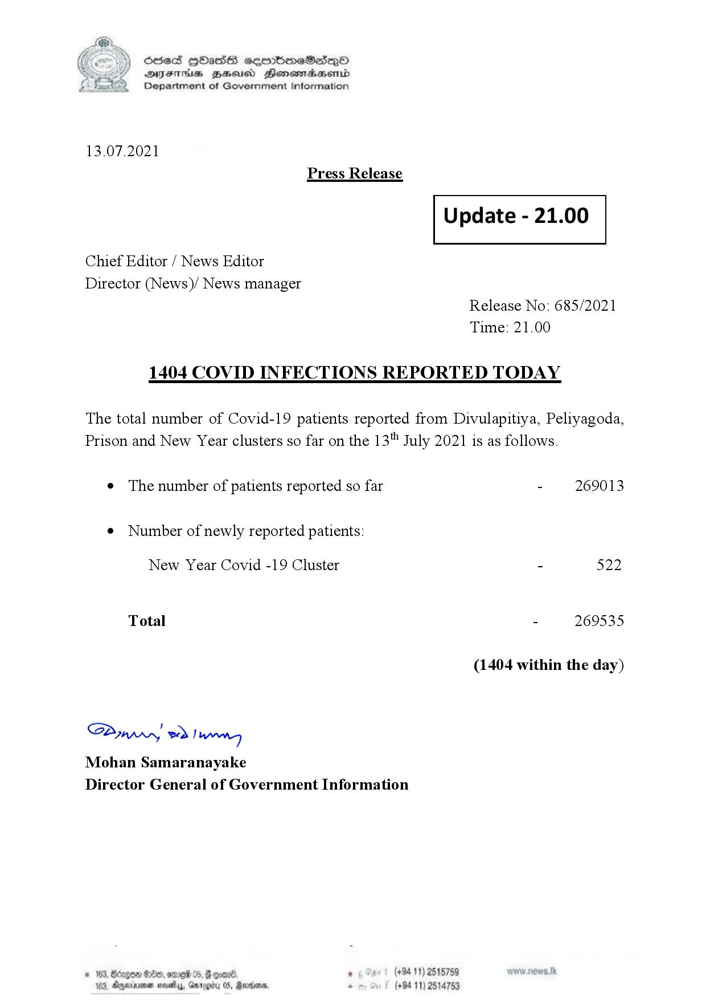

# Press Release - 2021.07.13 - Covid 19 infection report 
Key: f77083371ae55b4acafa8201e11dcbe7 

---
```
(6 S) ScseS HOasdS cerrbmeSdQo
DFTs BHEosd Henewtaeasernid
Department of Government Information

 

13.07.2021
Press Release

 

Update - 21.00

 

 

 

Chief Editor / News Editor

Director (News)/ News manager
Release No: 685/2021
Time: 21.00

1404 COVID INFECTIONS REPORTED TODAY

The total number of Covid-19 patients reported from Divulapitiya, Peliyagoda,
Prison and New Year clusters so far on the 13" July 2021 is as follows.

e The number of patients reported so far - 269013

¢ Number of newly reported patients:

New Year Covid -19 Cluster - 522
Total - 269535
(1404 within the day)

Saw 2) won,
Mohan Samaranayake
Director General of Government Information

. (+94 11) 2515759
(+94 11) 2514753

 

```
