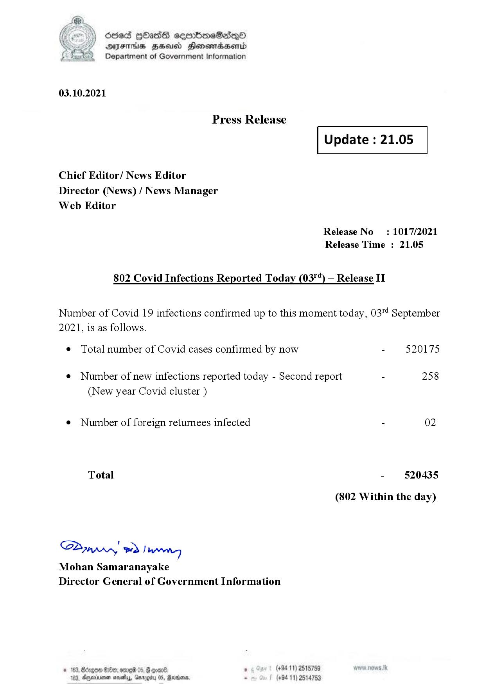

# Press Release - 2021.10.03 - Covid 19 Infection Report 
Key: f7bd7610ba9de70c450bc08fe179cd18 

---
```
dosed GOass eemmbmeSadepO
DFS BHU Honswnradasentd
Department of Government Information

 

 

03.10.2021

Press Release

Chief Editor/ News Editor
Director (News) / News Manager
Web Editor

 

 

Update : 21.05

 

 

Release No
Release Time :

802 Covid Infections Reported Today (03") — Release II

: 1017/2021
21.05

Number of Covid 19 infections confirmed up to this moment today, 03"! September

2021, is as follows.

¢ Total number of Covid cases confirmed by now

¢ Number of new infections reported today - Second report -

(New year Covid cluster )

¢ Number of foreign returnees infected

Total

SP nprrn wd Ianwng
Mohan Samaranayake
Director General of Government Information

 

. (+94 11) 2515759
(+94 11) 2514753

520175

258

02

520435

(802 Within the day)

```
