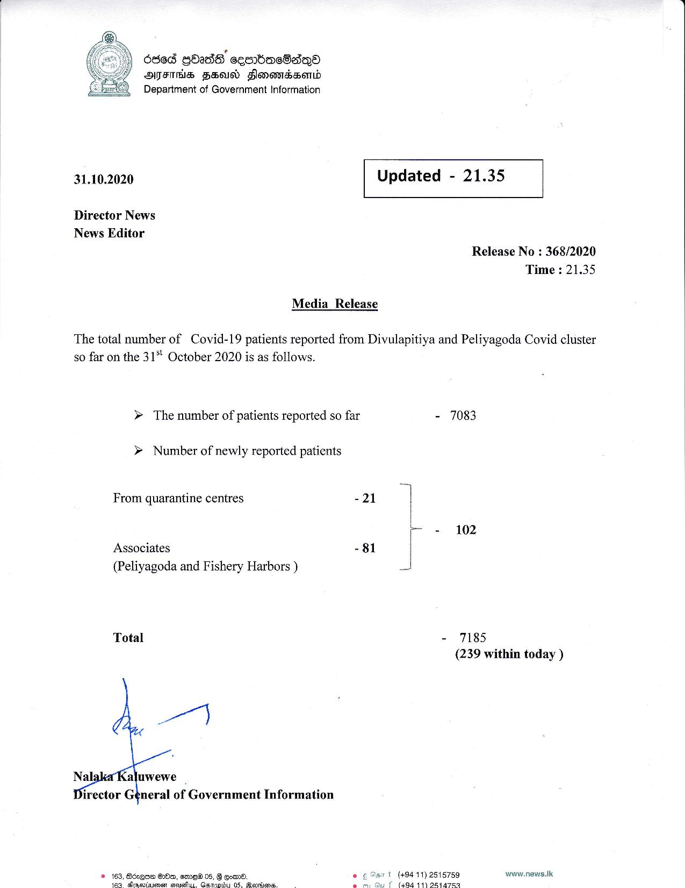

# Press Release - 2020.10.31 
Key: f7e5432b731b81e1b63de77c74341c3a 

---
```
636d GOS ces bacSadqQ®
ATES FS Slomomassenbd
Department of Government Information

    

Ee

 

31.10.2020 Updated - 21.35

 

 

 

Director News

News Editor
Release No : 368/2020

Time : 21.35
Media Release

The total number of Covid-19 patients reported from Divulapitiya and Peliyagoda Covid cluster
so far on the 31 October 2020 is as follows.

» The number of patients reported so far - 7083

> Number of newly reported patients

From quarantine centres -21
r= 102
Associates - 81 |
(Peliyagoda and Fishery Harbors )
- 7185

Total

(239 within today )

   

Nal: aluwewe
irector General of Government Information

t (494 11) 2515759 www.news.Ik
f (49411) 9814753

  

Boxgoe OOa, emo 05,  qoms,
etaenet Ctanies Gatnbu 0. Markos:

 

 

 

```
