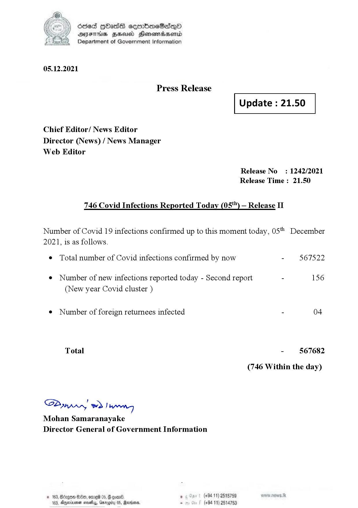

# Press Release - 2021.12.05 - Covid 19 Infection Report 
Key: f8d3ad53c03877f8794431d8a1db4623 

---
```
dosed GOass eemmbmeSadepO
DFS BHU Honswnradasentd
Department of Government Information

 

 

05.12.2021

Press Release

Chief Editor/ News Editor
Director (News) / News Manager
Web Editor

 

 

Update : 21.50

 

 

Release No
Release Time

746 Covid Infections Reported Today (05*") — Release II

: 1242/2021
: 21.50

Number of Covid 19 infections confirmed up to this moment today, 05" December

2021, is as follows.

¢ Total number of Covid infections confirmed by now

¢ Number of new infections reported today - Second report -

(New year Covid cluster )

¢ Number of foreign returnees infected

Total

SP nprrn wd Ianwng
Mohan Samaranayake
Director General of Government Information

GOD 100, omg 05
Doyerinsonen snevetyy, Garo

   

(+94 11) 2515759
(+94 11) 2514753

567522

156

04

567682

(746 Within the day)

```
