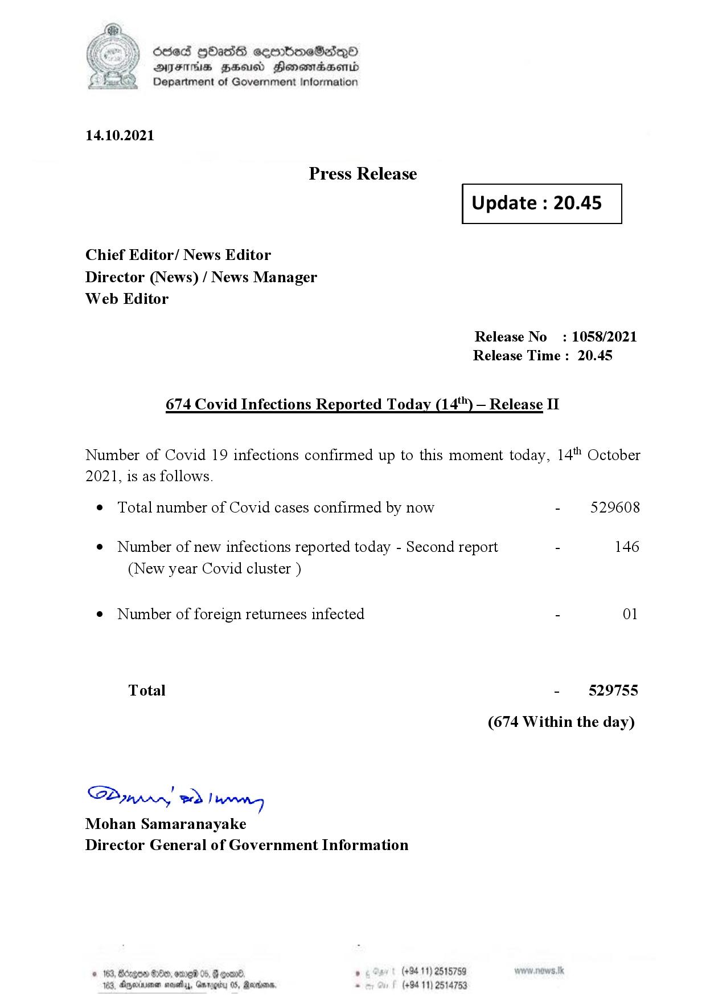

# Press Release - 2021.10.14 - Covid 19 Infection Report 
Key: f94b0c0f458e5aaa06933d4199e01d36 

---
```
dosed GOass eemmbmeSadepO
DFS BHU Honswnradasentd
Department of Government Information

 

 

14.10.2021

Press Release

Chief Editor/ News Editor
Director (News) / News Manager
Web Editor

 

 

Update : 20.45

 

 

Release No

: 1058/2021

Release Time : 20.45

674 Covid Infections Reported Today (14) — Release II

Number of Covid 19 infections confirmed up to this moment today, 14" October

2021, is as follows.

¢ Total number of Covid cases confirmed by now

¢ Number of new infections reported today - Second report -

(New year Covid cluster )

¢ Number of foreign returnees infected

Total

SP nprrn wd Ianwng
Mohan Samaranayake
Director General of Government Information

 

529608

146

01

529755

(674 Within the day)

. (+94 11) 2515759
(+94 11) 2514753

```
