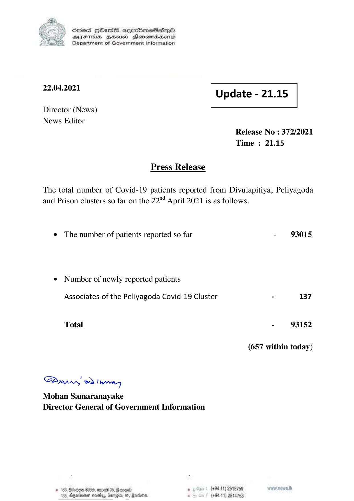

# Press Release - 2021.04.22 
Key: f965fec7e31c0787968a2c6623d56dd7 

---
```
YS Sssed HOasS soenbmeSedQo
DVsSTHUs BEd Henerradaernid
Department of Government Information

 

 

22.04.2021 Update - 21.15

 

 

 

Director (News)

News Editor
Release No : 372/2021
Time : 21.15

Press Release

The total number of Covid-19 patients reported from Divulapitiya, Peliyagoda
and Prison clusters so far on the 22" April 2021 is as follows.

e The number of patients reported so far - 93015

¢ Number of newly reported patients

Associates of the Peliyagoda Covid-19 Cluster - 137

Total - 93152

(657 within today)

SAywwy eo) wenn
Mohan Samaranayake
Director General of Government Information

. (+94 11) 2515789
(+94 11) 2514753

 

```
