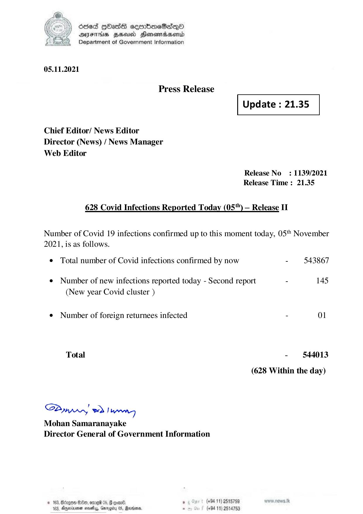

# Press Release - 2021.11.05 - Covid 19 Infection Report 
Key: f9e90e8cc941183bccc4b59804e1fe01 

---
```
) died Gass ceembeSsdqQo
DFS BHU Honswnradasentd
2 Department of Government Information

   

05.11.2021

Press Release

 

Update : 21.35

 

 

 

Chief Editor/ News Editor
Director (News) / News Manager
Web Editor

Release No: 1139/2021
Release Time : 21.35

628 Covid Infections Reported Today (05"") — Release IT

Number of Covid 19 infections confirmed up to this moment today, 05" November
2021, is as follows.

¢ Total number of Covid infections confirmed by now - 543867
¢ Number of new infections reported today - Second report - 145
(New year Covid cluster )
¢ Number of foreign returnees infected - 01
Total - 544013
(628 Within the day)

Saar eed Joanng
Mohan Samaranayake
Director General of Government Information

© 163, Beizgoe S00, ore 05, # goane ° (#94 11) 2518789
163, Aparna seseiy, Gnrogiry 05, Ravens, - (+94 11) 2514753

```
