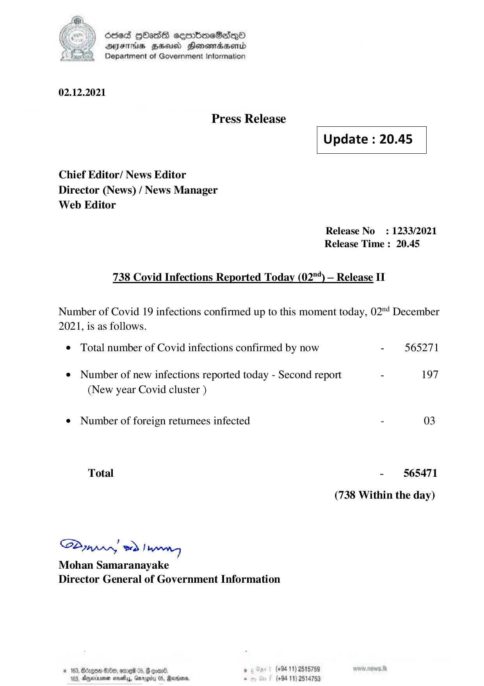

# Press Release - 2021.12.02 - Covid 19 Infection Report 
Key: fb0e09f3019da74135eb60be19824c29 

---
```
) died Gass ceembeSsdqQo
DFS BHU Honswnradasentd
2 Department of Government Information

  

02.12.2021

Press Release

 

Update : 20.45

 

 

 

Chief Editor/ News Editor
Director (News) / News Manager
Web Editor

Release No: 1233/2021
Release Time : 20.45

738 Covid Infections Reported Today (02"*) — Release II

Number of Covid 19 infections confirmed up to this moment today, 02"! December
2021, is as follows.

© Total number of Covid infections confirmed by now - 565271

¢ Number of new infections reported today - Second report - 197
(New year Covid cluster )

¢ Number of foreign returnees infected - 03

Total - 565471

(738 Within the day)

Sdn, ed Ngee
Mohan Samaranayake
Director General of Government Information

© 163, Bcngon Oe, ome 06, § coal, . (+94 11) 2515759
183, Dyyeriinen neve, Gmrogiy 05, Marans, - (+8411) 2514753

```
