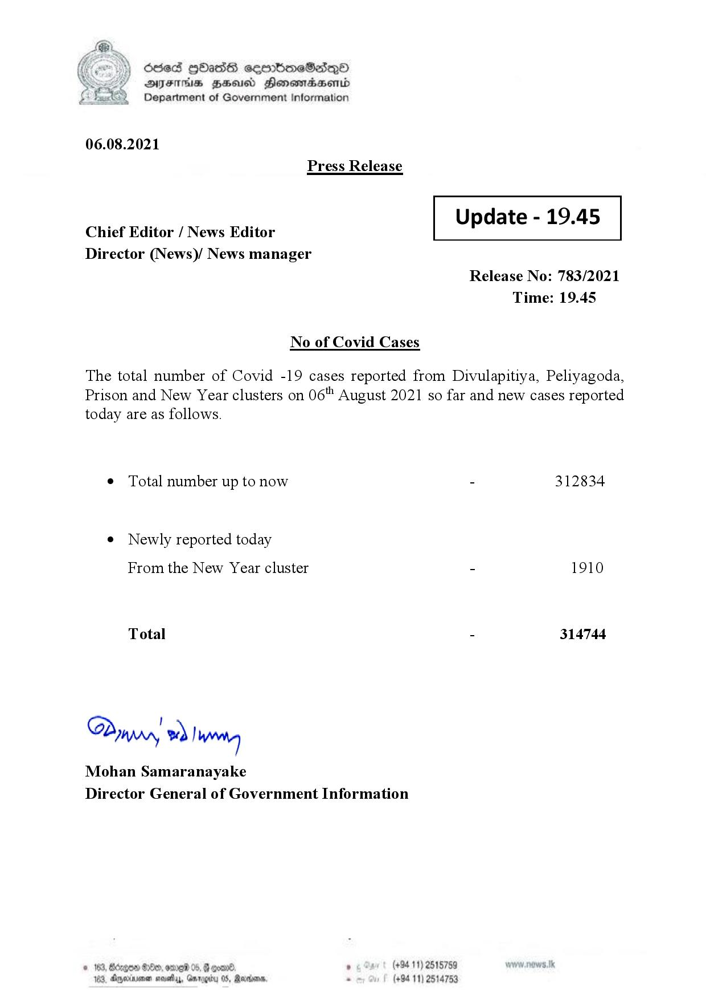

# Press Release - 2021.08.06 
Key: fc2789cabe72ab459e571503e5e96681 

---
```
dosed HOasG cemmbmeSadqO
DFS HHS Hensrradaentd
Department of Government Information

 

06.08.2021
Press Release

 

Update - 19.45

 

 

Chief Editor / News Editor
Director (News)/ News manager

 

Release No: 783/2021
Time: 19.45

No of Covid Cases

The total number of Covid -19 cases reported from Divulapitiya, Peliyagoda,
Prison and New Year clusters on 06" August 2021 so far and new cases reported
today are as follows.

¢ Total number up to now - 312834

¢ Newly reported today
From the New Year cluster - 1910

Total - 314744

@Q !
TWA, we ! wna
Mohan Samaranayake
Director General of Government Information

, (+94 11) 2515759
(+94 11) 2514753

 

```
