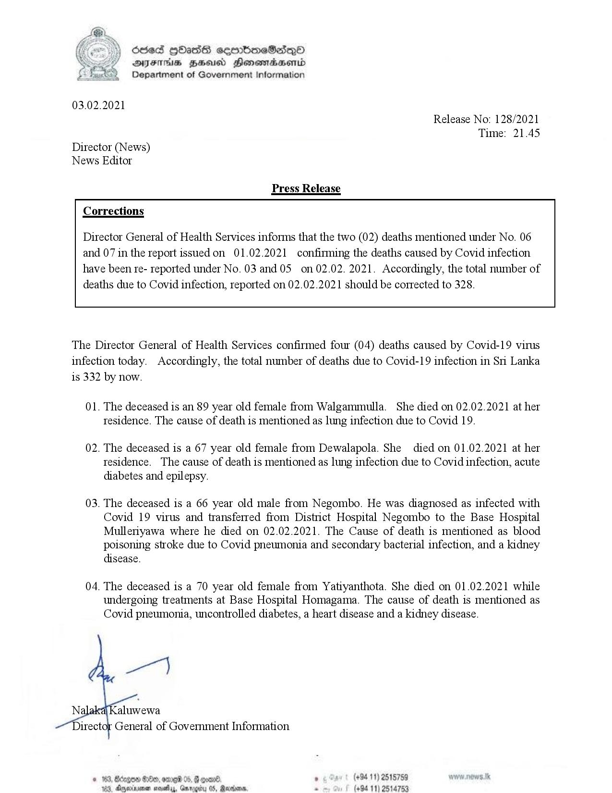

# Press Release - 2021.02.03 - Covid 19 Infection deaths 
Key: fc4e48c009e4ba5fabbf19a3e1f9f89b 

---
```
odes HOasG sembmeSadqoO
AIFS BHU Honomasenid
Department of Government Information

 

 

03.02.2021
Release No: 128/2021
Time: 21.45
Director (News)
News Editor
Press Release
Corrections

Director General of Health Services informs that the two (02) deaths mentioned under No. 06
and 07 in the report issued on 01.02.2021 confirming the deaths caused by Covid infection
have been re- reported under No. 03 and 05 on 02.02. 2021. Accordingly, the total number of
deaths due to Covid infection, reported on 02.02.2021 should be corrected to 328.

 

 

 

The Director General of Health Services confirmed four (04) deaths caused by Covid-19 virus
infection today. Accordingly, the total number of deaths due to Covid-19 infection in Sri Lanka
is 332 by now.

01. The deceased is an 89 year old female from Walgammulla. She died on 02.02.2021 at her
tesidence. The cause of death is mentioned as lung infection due to Covid 19.

02. The deceased is a 67 year old female from Dewalapola. She died on 01.02.2021 at her
tesidence. The cause of death is mentioned as lung infection due to Covid infection, acute
diabetes and epilepsy.

03. The deceased is a 66 year old male from Negombo. He was diagnosed as infected with
Covid 19 virus and transferred from District Hospital Negombo to the Base Hospital
Mulleriyawa where he died on 02.02.2021. The Cause of death is mentioned as blood
poisoning stroke due to Covid pneumonia and secondary bacterial infection, and a kidney
disease.

04. The deceased is a 70 year old female from Yatiyanthota. She died on 01.02.2021 while

undergoing treatments at Base Hospital Homagama. The cause of death is mentioned as
Covid pneumonia, uncontrolled diabetes, a heart disease and a kidney disease.

ye)

Ni aluwewa
rector General of Government Information.

. (+94 11) 2515759
(+94 11) 2514753

 

```
