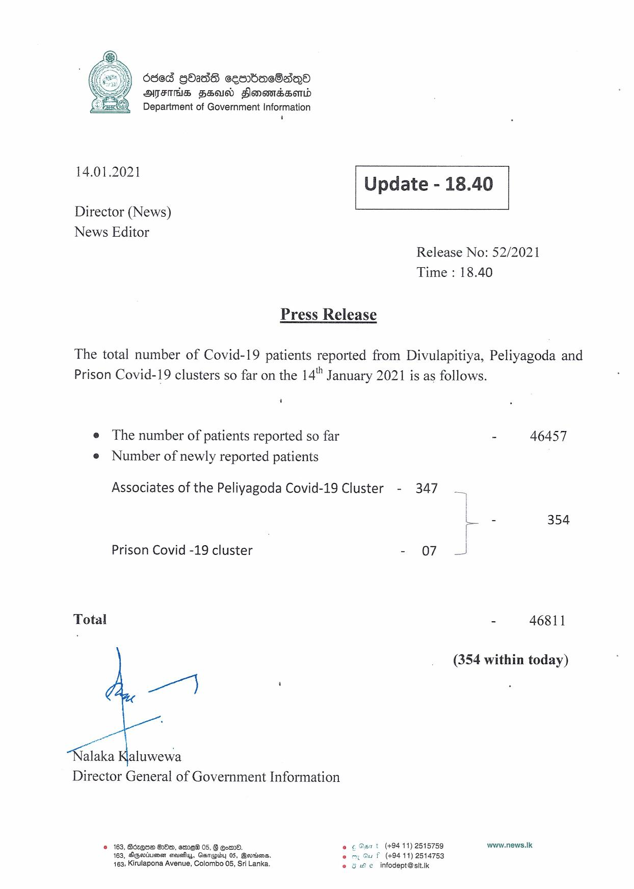

# Press Release - 2021.01.14 
Key: fcb4d304ad73e33bcec8076710560623 

---
```
dded GOadS cesnbachsqQ®
ANFTHS FSO Sonomssond

Department of Government Information
'

 

 

14.01.2021 Update - 18.40

 

 

 

Director (News)

News Editor
Release No: 52/2021

Time : 18.40

Press Release

The total number of Covid-19 patients reported from Divulapitiya, Peliyagoda and
Prison Covid-19 clusters so far on the 14" January 2021 is as follows.

‘

e The number of patients reported so far - 46457
e Number of newly reported patients

Associates of the Peliyagoda Covid-19 Cluster - 347
L. - 354
J

Prison Covid -19 cluster - o7 J

Total - 46811

(354 within today)

a}

alaka Kaluwewa
Director General of Government Information

t (+94 11) 2515759 www.news.Ik.
(+94 11) 2514753
© infodept@sit.ik

© 163, Berea OOo, emeW@ 05, Comm.
163, Agertumen causihys, Caneoiby 0S, Bersins.
163, Kirulapona Avenue, Colombo 05, Sri Lanka,

  

```
