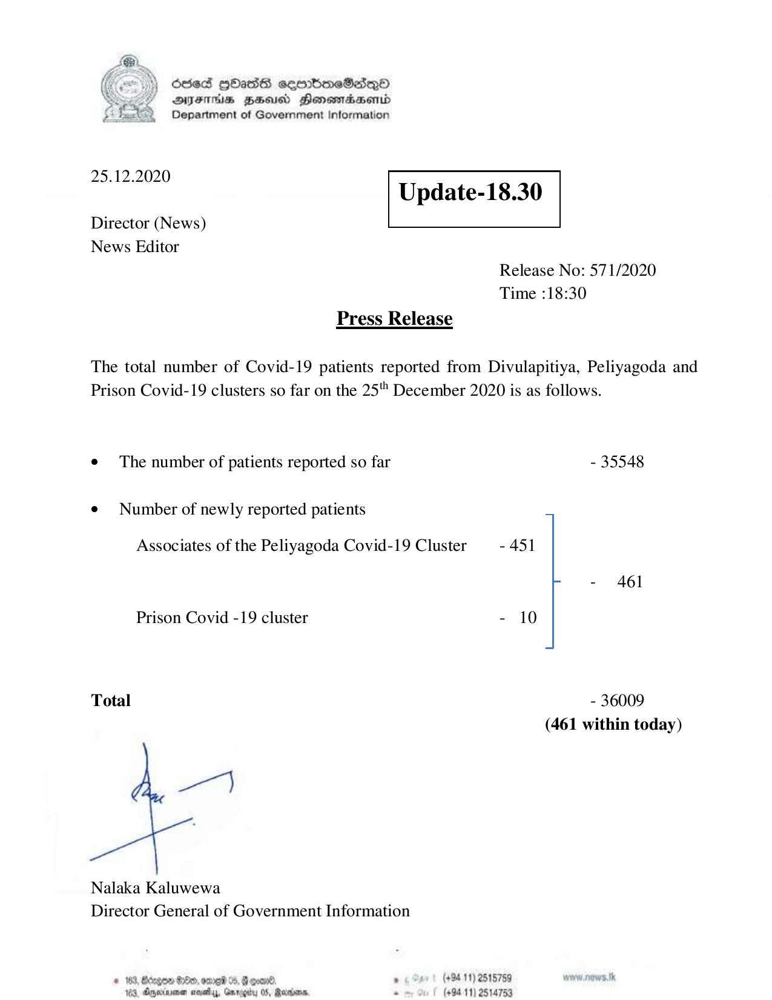

# Press Release - 2020.12.25 
Key: fcd2b56ab81488f40f55ebfb402711b7 

---
```
6563 HOHasG sembmcSasqQo
DAJFITAs BHU Honomrdbsertd
Department of Government Information

 

 

25.12.2020 Update-18.30

 

 

 

Director (News)
News Editor
Release No: 571/2020
Time :18:30
Press Release

The total number of Covid-19 patients reported from Divulapitiya, Peliyagoda and
Prison Covid-19 clusters so far on the 25" December 2020 is as follows.

e The number of patients reported so far - 35548

¢ Number of newly reported patients
Associates of the Peliyagoda Covid-19 Cluster - 451
- 461

Prison Covid -19 cluster - 10

Total - 36009
(461 within today)

Nalaka Kaluwewa
Director General of Government Information

# 163, Bergen 8:00, ome %, Geoan®. , (+84 11) 2515759 pw. news. tk
183, Oryeciarmer mosedlyy, Gnrogcu 05, Marisa. . (+9411) 2514753

```
