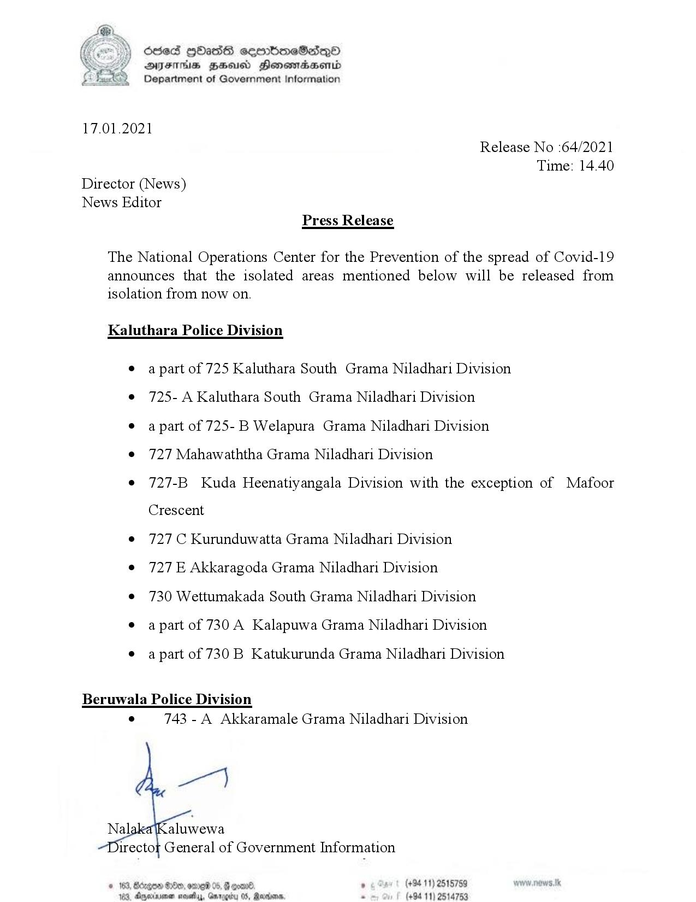

# Press Release - 2021.01.17 - Released from Isolation 
Key: fcfb7e7627a96f8d8513629a7f038a3a 

---
```
(oe) Scsed QOasSs eeortbneS2dqQ®
AIFS HHA Honemiradaerntd
Department of Government Information

 

17.01.2021
Release No :64/2021
Time: 14.40
Director (News)
News Editor
Press Release

The National Operations Center for the Prevention of the spread of Covid-19
announces that the isolated areas mentioned below will be released from
isolation from now on.

Kaluthara Police Division

© apart of 725 Kaluthara South Grama Niladhari Division
e 725- A Kaluthara South Grama Niladhari Division

© apart of 725-B Welapura Grama Niladhari Division

© 727 Mahawaththa Grama Niladhari Division

¢ 727-B Kuda Heenatiyangala Division with the exception of Mafoor

Crescent
¢ 727 C Kurunduwatta Grama Niladhari Division
e@ 727E Akkaragoda Grama Niladhari Division
¢ 730 Wettumakada South Grama Niladhari Division
© apart of 730 A Kalapuwa Grama Niladhari Division
© apart of 730B Katukurunda Grama Niladhari Division

Beruwala Police Division
° 743 - A Akkaramale Grama Niladhari Division

(+94 11) 2515759
(+94 11) 2514753

 

```
