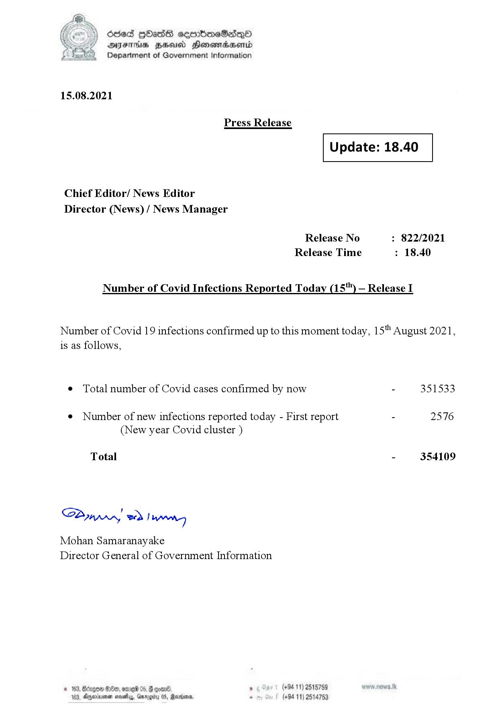

# Press Release  - 2021.08.15 
Key: fd27c95503a9ddeb2edb0cc712889bd5 

---
```
(2) Oded QOasS cseenboeSiqQo
DFS HHS Honsmnadaerntd
Department of Government Information

 

15.08.2021

Press Release

 

Update: 18.40

 

 

 

Chief Editor/ News Editor
Director (News) / News Manager

Release No : 822/2021
Release Time : 18.40

Number of Covid Infections Reported Today (15") — Release I

Number of Covid 19 infections confirmed up to this moment today, 15" August 2021,
is as follows,

¢ Total number of Covid cases confirmed by now - 351533

¢ Number of new infections reported today - First report - 2576
(New year Covid cluster )

Total - 354109

SB, eed | Mens

Mohan Samaranayake
Director General of Government Information

   

188, Anexivenan noes, Garogiy 05, Mardoorn,

```
