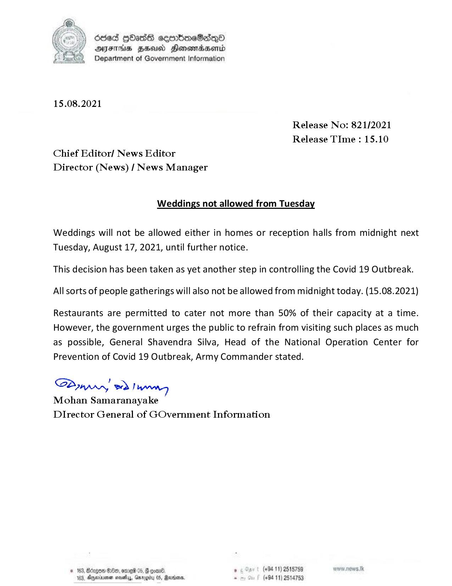

# Press Release  - 2021.08.15 - Weddings not allowed from Tuesday 
Key: fdd400735c09cfd649517d29b85b6bf7 

---
```
 

dded GbasG cseomboeSedepO
AIFS HHS Monemradwerid
Department of Government Information

 

15.08.2021

Release No: 821/2021
Release TIme : 15.10
Chief Editor/ News Editor
Director (News) / News Manager

Weddings not allowed from Tuesday

Weddings will not be allowed either in homes or reception halls from midnight next
Tuesday, August 17, 2021, until further notice.

This decision has been taken as yet another step in controlling the Covid 19 Outbreak.
All sorts of people gatherings will also not be allowed from midnight today. (15.08.2021)

Restaurants are permitted to cater not more than 50% of their capacity at a time.
However, the government urges the public to refrain from visiting such places as much
as possible, General Shavendra Silva, Head of the National Operation Center for
Prevention of Covid 19 Outbreak, Army Commander stated.

SPinpnry ed!
Mohan Samaranayake
DIrector General of GOvernment Information

© 163, Bdrgon Oe, omed 0 . (+94 11) 2515759
163, Ageia sathy,, Garogity 05, Rares - (+94 11) 2514753

 

```
