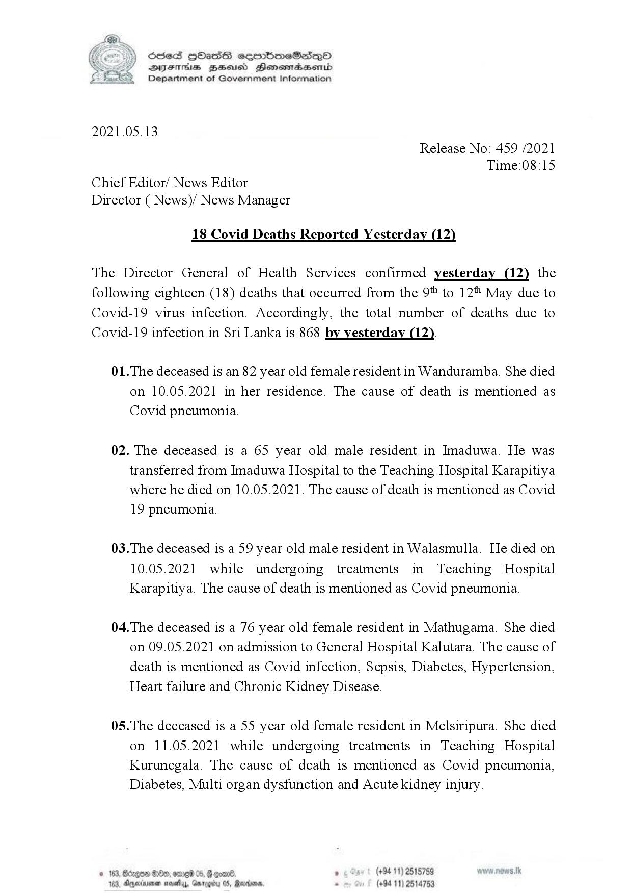

# Press Release - 2021.05.13 - Covid 19 infection deaths reported yesterday ( 12) 
Key: fdf36701e16d1b87cfcfb0567e86a913 

---
```
(ieee s) Sced HbasS sermimeScsepO
SVEThis ZHeusd Henomasenid
Department of Government Information

 

2021.05.13
Release No: 459 /2021
Time:08:15
Chief Editor/ News Editor
Director ( News)/ News Manager

18 Covid Deaths Reported Yesterday (12)

The Director General of Health Services confirmed yesterday (12) the
following eighteen (18) deaths that occurred from the 9" to 12 May due to
Covid-19 virus infection. Accordingly, the total number of deaths due to
Covid-19 infection in Sri Lanka is 868 by yesterday (12).

01.The deceased is an 82 year old female resident in Wanduramba. She died
on 10.05.2021 in her residence. The cause of death is mentioned as
Covid pneumonia.

02. The deceased is a 65 year old male resident in Imaduwa. He was
transferred from Imaduwa Hospital to the Teaching Hospital Karapitiya
where he died on 10.05.2021. The cause of death is mentioned as Covid
19 pneumonia.

03.The deceased is a 59 year old male resident in Walasmulla. He died on
10.05.2021 while undergoing treatments in Teaching Hospital
Karapitiya. The cause of death is mentioned as Covid pneumonia.

04.The deceased is a 76 year old female resident in Mathugama. She died
on 09.05.2021 on admission to General Hospital Kalutara. The cause of
death is mentioned as Covid infection, Sepsis, Diabetes, Hypertension,
Heart failure and Chronic Kidney Disease.

05.The deceased is a 55 year old female resident in Melsiripura. She died
on 11.05.2021 while undergoing treatments in Teaching Hospital
Kurunegala. The cause of death is mentioned as Covid pneumonia,
Diabetes, Multi organ dysfunction and Acute kidney injury.

Ayeririemen nosey, Gnr

 

. (+94 11) 2515789
(+94 11) 2514753

   

```
