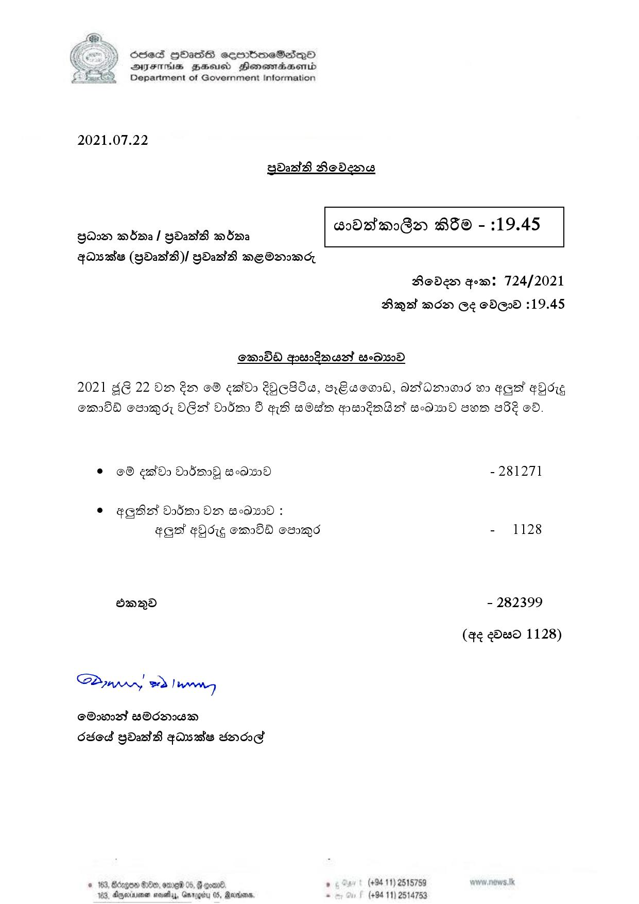

# Press Release - 2021.07.22 
Key: fe307eefcfac45e86e83a452b3b68adf 

---
```
6856S HHass sermbmeSasqo
DIsFHsS BHsusd Henewmiaaentd
Department of Government Information

 

2021.07.22

BdatB Roden

 

edsmsG@e B® - :19.45

 

 

Bavw mdaa/ ydasth mbma
qasadtes (YDatH)/ YdastA mEOmmcj

 

Boden gom: 724/2021
Brayat mow Ge ©DE@o 319.45

OMIDA goewsokmust eeD250D

2021 48 22 Om &xD O® eatdo EQERIG, BEoOOd, ASADa6 wo eGat DoE
emda euomd, O62 Odean 5 HB sOdm pertobsl 6Owd sow 352 od.

© ©® ead Do5m09 8A - 281271

© ¢@Bst do5m0 OD ww :
aaa gQd~g emda oso~Md - 1128

oad - 282399

(4¢ eDesd 1128)

S2onwr, ed] won]

Ort BOdm8
Sod YdatB gasates knoe

© 163, Borgen 8200, ome 06, G goar® , (+94 11) 2515759
103, Agere seve, Qnty Barons. . (+94 11) 2514753

 

```
