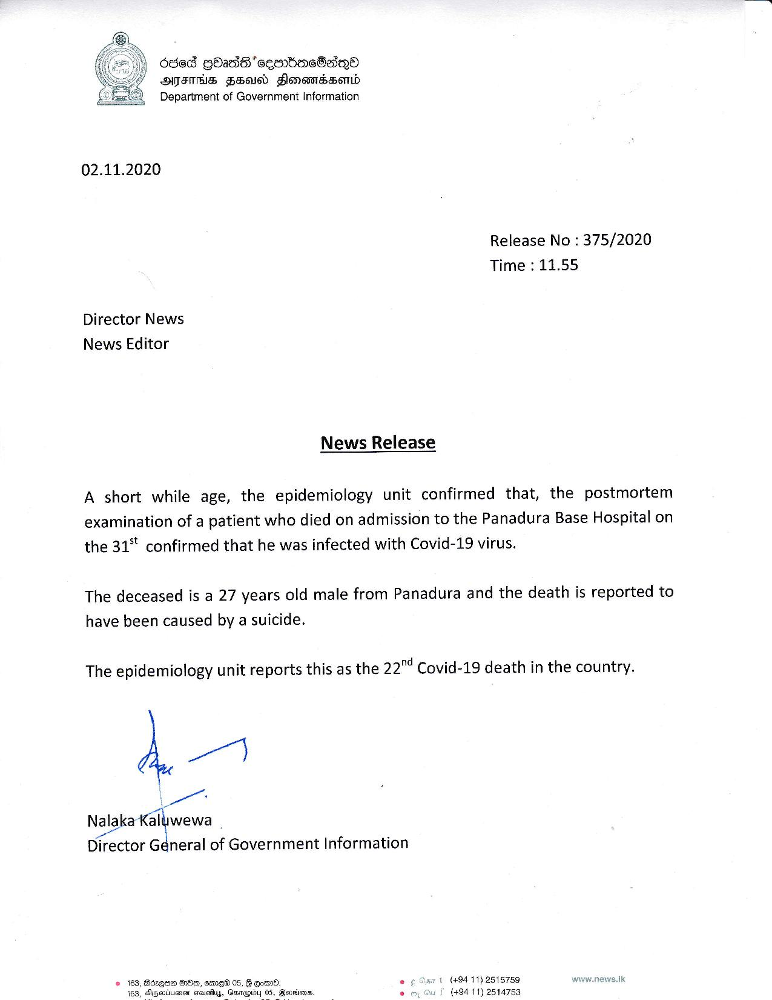

# Press Release - 2020.11.02 - The 22nd Covid 19 death has been reported 
Key: fe3f5c7dace0c48712310d570b78c7b4 

---
```
Od6E GOAdS  cemrbacBsqyo
ATITHS FHA Flonemassorld
Department of Government Information

 

02.11.2020
Release No : 375/2020
Time : 11.55

Director News
News Editor

News Release

A short while age, the epidemiology unit confirmed that, the postmortem
examination of a patient who died on admission to the Panadura Base Hospital on
the 31° confirmed that he was infected with Covid-19 virus.

The deceased is a 27 years old male from Panadura and the death is reported to
have been caused by a suicide.

The epidemiology unit reports this as the 22"! Covid-19 death in the country.

4

an
Nalaka Kalwewa
Director General of Government Information

© 163, Bdzqee Hm, eme® 05, & Eom. © ¢ Sir t (494 11) 2515759 nvw.news.IK
163, Dupoviuensn stavafiyy, eso 6. oy Gu | 494 11) 2514753

  

```
