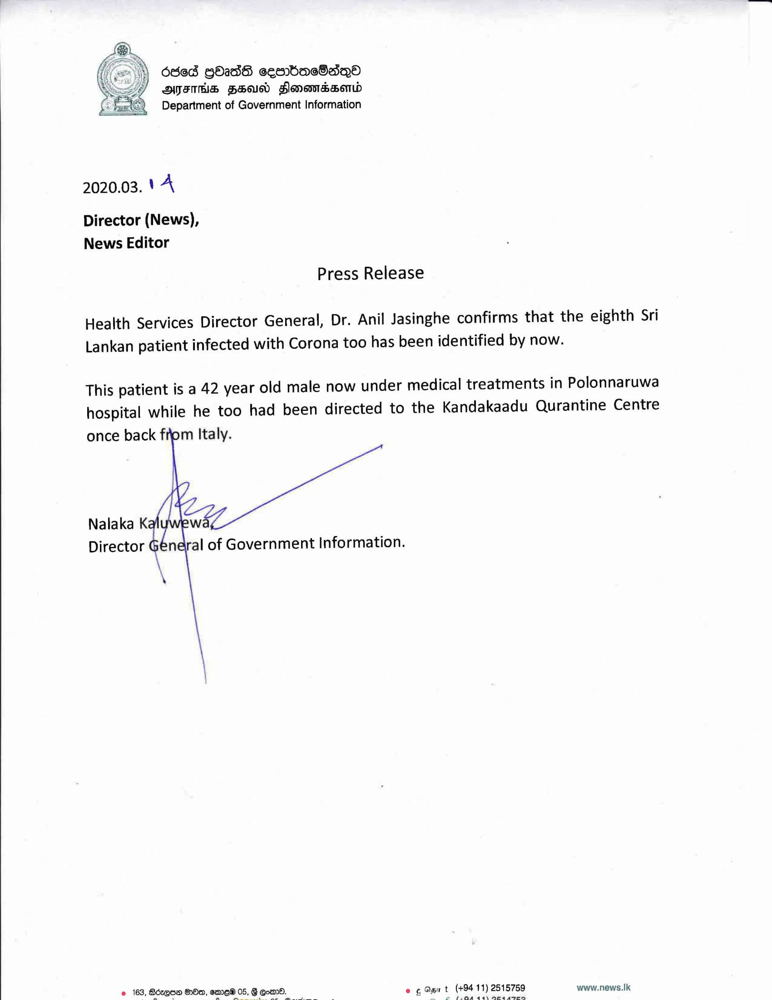

# Press Release - 14.03.2020 
Key: fe7dc170ab2ac2eb982c7352c69248e7 

---
```
 

 

66d Gbadd ceenbaeBadQo®
AIITHS FEU Slonorndssend
Department of Government Information

 

2020.03. 'A

Director (News),
News Editor

Press Release

Health Services Director General, Dr. Anil Jasinghe confirms that the eighth Sri
Lankan patient infected with Corona too has been identified by now.

This patient is a 42 year old male now under medical treatments in Polonnaruwa
hospital while he too had been directed to the Kandakaadu Qurantine Centre

once back from Italy.

   
 

Nalaka K

Director General of Government Information.

e 163, Bdzese do, emed 05, 8 @oem. ee Ogsrt (+94 11) 2515759 www.news.Ik

CO a Dp a eh dbs ane

```
