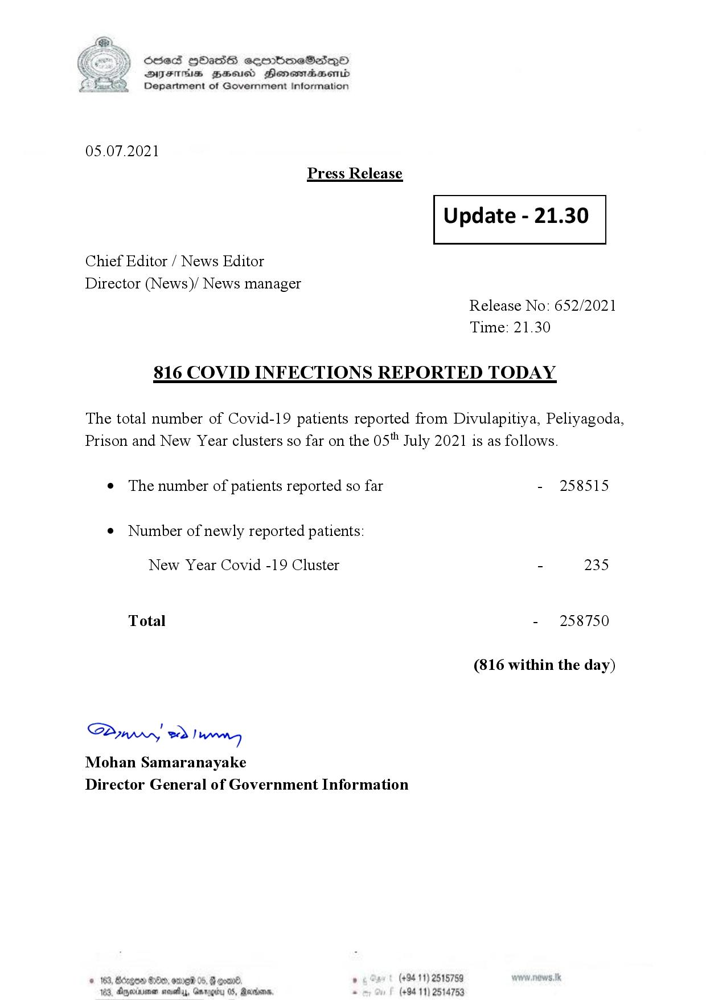

# Press Release - 2021.07.05 - Covid 19 infection report 
Key: fe9f63867a39beabc54759b831ca72a1 

---
```
(6 S) ScseS HOasdS cerrbmeSdQo
DFTs BHEosd Henewtaeasernid
Department of Government Information

 

05.07.2021
Press Release

Chief Editor / News Editor
Director (News)/ News manager

 

 

Update - 21.30

 

 

Release No: 652/2021
Time: 21.30

816 COVID INFECTIONS REPORTED TODAY

The total number of Covid-19 patients reported from Divulapitiya, Peliyagoda,
Prison and New Year clusters so far on the 05" July 2021 is as follows.

e The number of patients reported so far

¢ Number of newly reported patients:

New Year Covid -19 Cluster

Total

Saw 2) won,
Mohan Samaranayake
Director General of Government Information

© 163, ong

 

- 258515

- 235

- 258750

(816 within the day)

00, ome 05, § qoar® , (+94 11) 2515759

103, Ageinvemen wos, Garg 05, Randers. . (+94 11) 2514753

```
